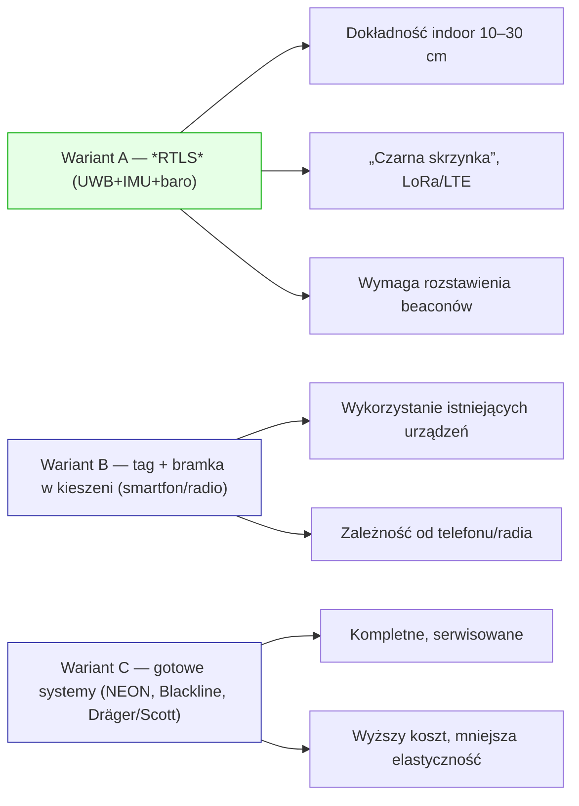
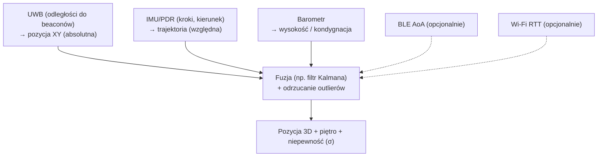
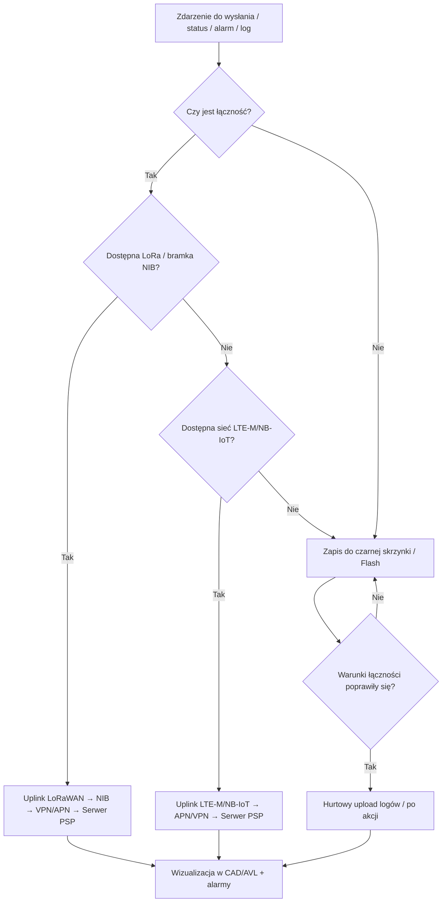
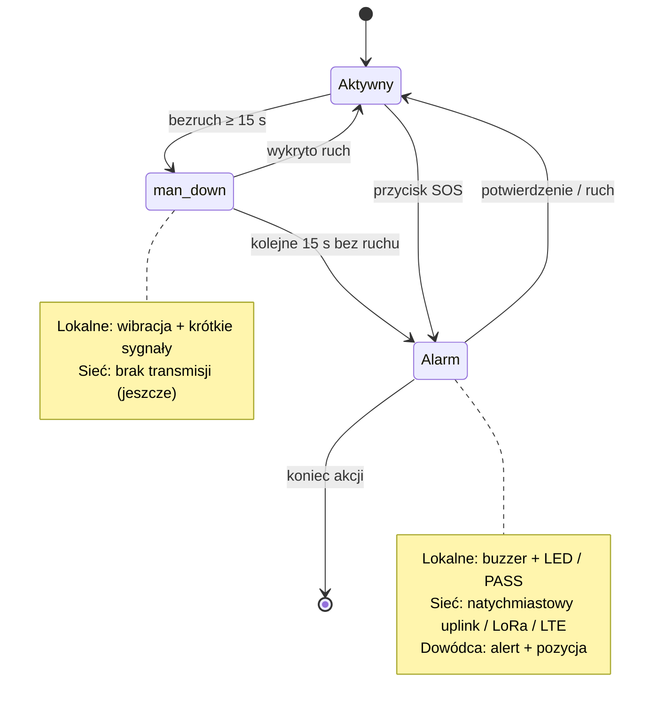
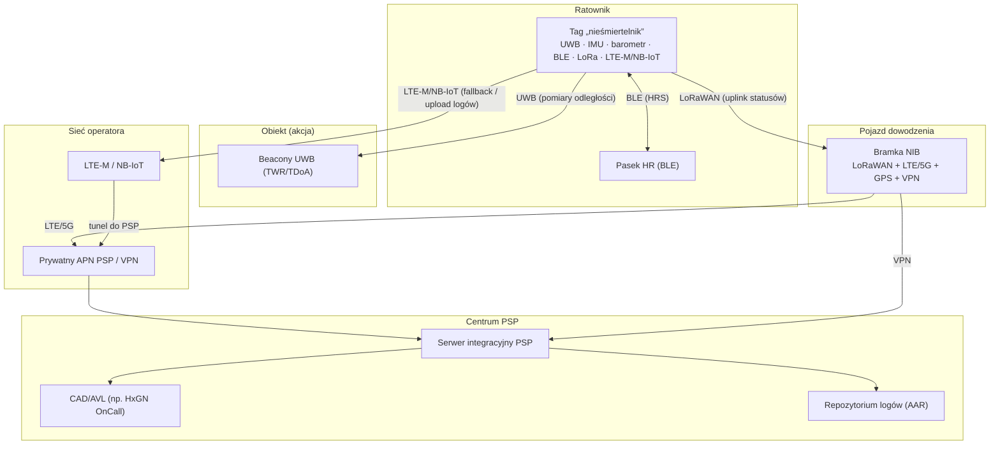
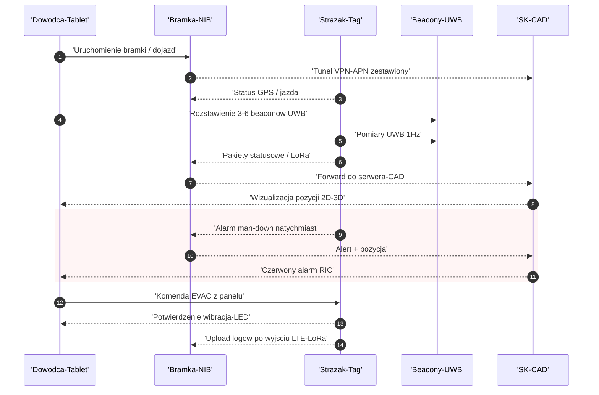
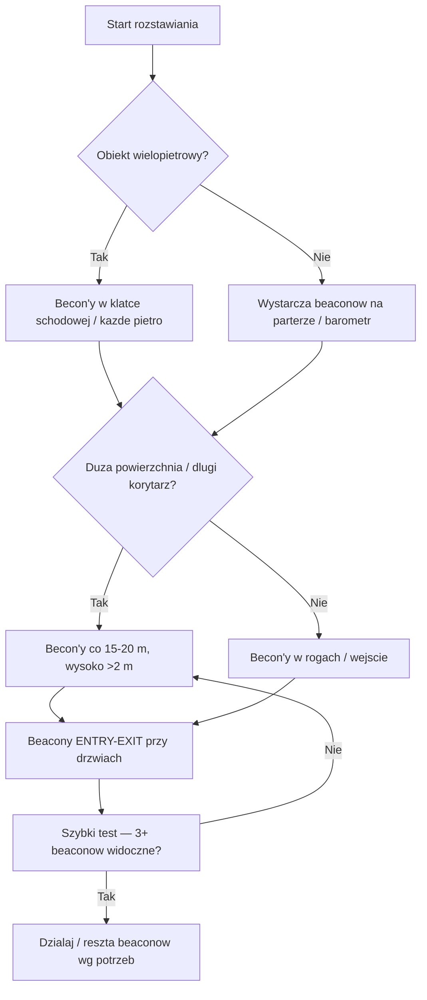
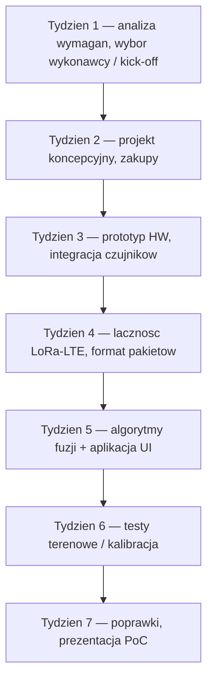
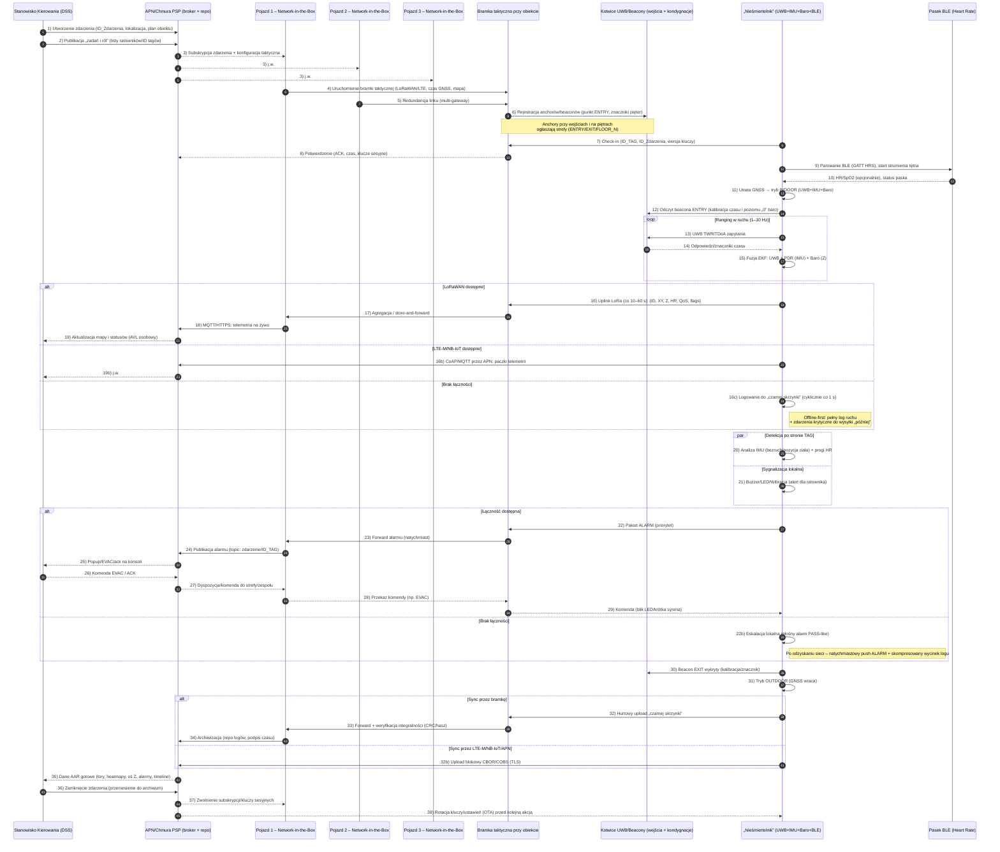

# PoC cyfrowego „nieśmiertelnika” dla strażaków PSP i OSP

## Cel i założenia projektu

## Słowniczek pojęć i skrótów

- **Beacon** – przenośny nadajnik referencyjny (UWB/BLE) rozmieszczany w obiekcie; wcześniej w tekście nazywany „kotwicą"/„beaconem".
- **Tag „nieśmiertelnik”** – nasobne urządzenie strażaka z UWB/IMU/baro/BLE/LoRa/LTE-M, zapisujące „czarną skrzynkę”.
- **NIB (Network-in-the-Box) / bramka taktyczna** – urządzenie w pojeździe zbierające dane z tagów (LoRaWAN) i przekazujące je do systemów PSP (APN/VPN).
- **LoRa / LoRaWAN** – LoRa to modulacja radiowa, LoRaWAN to protokół sieciowy działający w paśmie ISM.
- **RTLS** – *Real-Time Location System*, system lokalizacji w czasie rzeczywistym (np. UWB+IMU+barometr).
- **CAD/AVL** – system stanowiska kierowania (np. HxGN OnCall): CAD – wsparcie dowodzenia; AVL – wizualizacja lokalizacji.
- **PASS / „man-down”** – sygnalizator bezruchu oraz logika alarmu ratownika.
- **SCBA** – sprzęt ochrony dróg oddechowych.

Celem projektu jest opracowanie **prototypu (PoC)** systemu osobistego dla strażaków – tzw. **„cyfrowego nieśmiertelnika”**. System ten ma zwiększyć bezpieczeństwo ratowników Państwowej Straży Pożarnej (PSP) oraz Ochotniczych Straży Pożarnych (OSP) poprzez monitorowanie lokalizacji i podstawowych parametrów życiowych strażaka podczas akcji, **także w strefach bez sygnału GPS (budynki, podziemia)**.

### Najważniejsze założenia:

- **Niewielkie, proste urządzenie**, stale noszone przez strażaka (np. jak tradycyjny nieśmiertelnik na szyi lub przypięte do munduru/aparatu). Ma być **bezobsługowe** w trakcie akcji.

- **Lokalizacja hybrydowa**: urządzenie rejestruje pozycję strażaka wewnątrz budynków (**offline, w pamięci lokalnej – tzw. „czarna skrzynka"**), a transmituje ją na zewnątrz **w czasie rzeczywistym tylko, gdy jest łączność**. Na zewnątrz korzysta z GPS; wewnątrz – z alternatywnych metod (UWB, BLE, Wi-Fi, IMU – opisane dalej).

- **Długotrwała praca na baterii**: urządzenie ma działać przez całą akcję (w razie potrzeby wiele godzin), a w trybie czuwania – wiele dni. Dlatego priorytetem jest energooszczędność i tryb offline-first (nagrywanie danych, a nie ciągła transmisja).

- **Podstawowe dane życiowe** monitorowane w sposób prosty i niezawodny: minimum **tętno** (HR) oraz detekcja **bezruchu/upadku** strażaka (**alarm man-down**). Opcjonalnie można rozważyć pomiar temperatury skóry czy częstości oddechów, ale priorytetem jest niezawodność podstawowych funkcji.

- **Odporność i ergonomia**: urządzenie musi być odporne na warunki akcji (woda, wysoka temperatura, uderzenia – minimalnie standard IP67, zakres temperatur operacyjnych sprzętu pożarniczego). Jeśli planowane jest użycie w strefach zagrożonych wybuchem, docelowo przewidziano wersję iskrobezpieczną **ATEX/IECEx** (co jednak zwiększy wymiary i koszt).

- **Lokalizacja w budynkach bez GPS**: zastosowanie technologii **Ultra-Wideband (UWB)** do precyzyjnego pomiaru odległości od rozstawionych tymczasowo **beaconów (beaconów)** oraz wykorzystanie czujników inercyjnych (**IMU**) i **barometrycznego wysokościomierza** dla określenia kondygnacji. Na zewnątrz wykorzystywany standardowy **GNSS (GPS/Galileo)**.

- **Łączność radiowa**: rozwiązanie **offline-first** – priorytetem jest zapis danych lokalnie. Transmisja na żywo odbywa się **tylko wtedy, gdy sieć jest dostępna**, za pomocą niskoenergetycznych technologii dalekiego zasięgu (np. **LoRaWAN** z prywatną bramką w pojeździe) lub sieci komórkowej IoT (**LTE-M / NB-IoT**) z prywatnym APN PSP. System ma działać również w terenie bez zasięgu radiowego – wtedy dane pozostają w „czarnej skrzynce" i są wysłane po pojawieniu się łączności.

- **Integracja**: dane z systemu mają trafiać do stanowiska kierowania/dyspozytora (np. system CAD **HxGN OnCall** używany w PSP) – czyli pojawienie się ikony strażaka na mapie z informacją o jego pozycji (w tym kondygnacji) i stanie (ruch/bezruch, tętno, alarm SOS). System powinien też móc współpracować z istniejącą telemetrią aparatu powietrznego (sprzętu ochrony dróg oddechowych, SCBA) – np. odbierać alarmy distress z aparatów **Dräger** czy **Scott**.

Te założenia czynią urządzenie przydatnym zarówno dla PSP, jak i dla jednostek OSP – sprzęt może być rozdysponowany również ochotnikom, aby w razie wspólnych akcji wszyscy ratownicy byli widoczni w jednym systemie bezpieczeństwa osobistego.

*Diagram 2. Warianty rozwiązania — mapa opcji.*

Po analizie dostępnych technologii i rozwiązań, rekomendujemy **etapowe podejście** do wdrożenia systemu, rozpoczynając od stosunkowo prostego wariantu i stopniowo rozszerzając funkcjonalność. Poniżej trzy rozważane warianty:

### Wariant A – „Nieśmiertelnik RTLS" (rekomendowany jako główny kierunek)

Nasobny tag UWB z IMU i barometrem, zapewniający precyzyjną lokalizację wewnątrz budynków (RTLS — *Real-Time Location System*). Dodatkowo można rozstawić **beacony/beaconów UWB** przy wejściach i kluczowych obszarach obiektu dla zwiększenia dokładności. Po wyjściu na zewnątrz tag korzysta z GPS. 

**Charakterystyka:**
- Dane są zapisywane lokalnie („czarna skrzynka"), a od czasu do czasu wysyłane na zewnątrz (uplink) przez łącze dalekiego zasięgu
- Preferowany **LoRaWAN** (np. bramka LoRa w pojeździe) lub ewentualnie sieć komórkowa IoT (LTE-M / NB-IoT)
- **Dokładność lokalizacji indoor**: w testach UWB osiąga się zwykle **10–30 cm** błędu w poziomie przy poprawnym rozmieszczeniu beaconów
- Wysokość/kondygnacja określana z czujnika ciśnienia
- Minimalne gabaryty tagu (tylko najważniejsze moduły)

### Wariant B – „Tag + bramka w kieszeni"

Uproszczony tag (np. tylko BLE lub UWB + IMU) noszony przez strażaka, **sparowany ze smartfonem lub radiostacją** pełniącą rolę bramki i urządzenia pośredniczącego.

**Charakterystyka:**
- Telefon/radio (w kieszeni dowódcy lub każdego ratownika) zapewnia połączenie z siecią (Wi-Fi/LTE)
- Dodatkowe technologie lokalizacyjne jak **Wi-Fi RTT (IEEE 802.11mc/az)** czy **Bluetooth AoA** jeśli obiekt jest wyposażony w taką infrastrukturę
- **Zalety**: wykorzystanie istniejących urządzeń
- **Wady**: zależność od smartfona (który w warunkach akcji może być narażony na zniszczenie, rozładowanie lub brak zasięgu Wi-Fi)

### Wariant C – „Gotowe systemy lone-worker/pożarnicze"

Zakup i wdrożenie gotowych rozwiązań dostępnych na rynku, dedykowanych dla służb ratowniczych.

**Przykłady systemów:**
- **TRX Systems NEON** (lokalizacja w strefach bez GPS z fuzją czujników)
- **Blackline Safety G7** (osobisty detektor z łącznością komórkową/satelitarną, czujnikiem bezruchu i beaconami indoor)
- **Dräger PSS Merlin** czy **3M Scott Pak-Tracker/SEMS II** (telemetryczne systemy wbudowane w aparaty powietrzne)

**Zalety:**
- Kompletne, przetestowane ekosystemy (urządzenia + platforma chmurowa)
- Od razu dostępne wraz ze wsparciem serwisowym

**Wady:**
- **Wysoki koszt jednostkowy**
- Większe rozmiary i masa urządzeń (często integracja z aparatem oddechowym lub oddzielne urządzenie wielkości radiostacji)
- Mniejsza elastyczność modyfikacji
- W polskich realiach ich „lekkość" i spełnienie lokalnych wymogów mogą być gorsze niż przy rozwiązaniu szytym na miarę

### Rekomendacja ogólna

Rozpocząć od **Wariantu A** w wybranym środowisku kontrolowanym (np. magazyn szkoleniowy, gdzie łatwo rozmieścić infrastrukturę UWB i przetestować system). Równolegle można w ograniczonym zakresie sprawdzić **Wariant B** w obiektach, które już mają sieć Wi-Fi RTT lub systemy lokalizacji wewnętrznej – wtedy tag strażaka może korzystać z tej infrastruktury.

W specyficznych akcjach specjalnych (np. poszukiwania w terenie, działania na dużym obszarze bez infrastruktury) warto rozważać elementy **Wariantu C** lub integrację z nim – np. wykorzystanie przenośnych beaconów z systemów Blackline czy modułów lokalizacji z aparatów powietrznych, jeśli są na wyposażeniu.

**Etapy wdrożenia:**
- **Etap I** – budowa własnego prostego systemu RTLS (wariant A) i pilotaż
- **Etap II** – rozszerzenie o integrację z urządzeniami mobilnymi (wariant B) i testy w terenie  
- **Etap III** – ocena zasadności zakupu/dalszego rozwoju gotowych systemów (wariant C) w niszowych zastosowaniach

## Technologie lokalizacji – co działa wewnątrz budynków

*Diagram 3. Fuzja lokalizacji indoor — rola technologii.*

Lokalizowanie strażaka w środowisku **GPS-denied** (wewnątrz budynków, podziemia) to największe wyzwanie systemu. Poniżej omawiamy dostępne technologie i ich charakterystykę:

### Ultra-Wideband (UWB)

Technologia radiowa (IEEE 802.15.4a/4z) umożliwiająca **pomiar czasu przelotu sygnału (Time-of-Flight)** z bardzo wysoką precyzją. Nasobny **tag UWB** u strażaka może zmierzyć dystans do kilku **beaconów (beaconów)** rozmieszczonych w budynku. Z co najmniej trzech odległości obliczana jest pozycja 2D (triangulacja), a z czterech – 3D. Typowa osiągana dokładność w hali to **10–30 cm** przy sensownym rozmieszczeniu beaconów. Warunkiem jest dobra geometria rozmieszczenia (beaconów otaczających obszar, umieszczonych wysoko, ze wzajemną linią widzenia). Zasady praktyczne: **~1 beacon na 100 m2** powierzchni, odległości między beaconami zwykle **≤15–20 m**; dla zapewnienia 3D – beaconów na różnych wysokościach lub wykorzystanie barometru do wysokości. UWB radzi sobie lepiej od innych technologii w obecności dymu i zjawiska wielodrożności (multipath), dzięki krótkim impulsom i szerokiemu widmu. W PoC zakładamy wykorzystanie trybu **TWR (Two-Way Ranging)** – tag wypuszcza serię „pingów” do beaconów i mierzy czasy odpowiedzi (nie wymaga to synchronizacji zegarów beaconów, co upraszcza ad-hoc instalację). Docelowo w rozwiniętym systemie można rozważyć tryb **TDoA (Time Difference of Arrival)** – beacony nasłuchują tagu i system wylicza pozycję z różnic czasów (lepsze skalowanie do wielu tagów, ale wymaga synchronizacji beaconów – np. po kablu lub przez sieć radiową UWB). UWB jest odporny na warunki pożarowe, ale wymaga **rozstawienia infrastruktury** w budynku – to zadanie dla dowódcy lub wyznaczonego ratownika po przybyciu na miejsce (rozłożenie kilku bezprzewodowych beaconów z własnym zasilaniem w kluczowych punktach wejścia).

### Bluetooth Low Energy (BLE) – kierunkowe (Angle-of-Arrival, AoA)

Standard BLE 5.1 wprowadził możliwość wyznaczania kierunku sygnału za pomocą **anten fazowanych**. Systemy takie jak **Quuppa** osiągają sub-metrową dokładność w sprzyjających warunkach. Działanie polega na montażu w obiekcie **anten kierunkowych BLE** (listenerów) i nasobnych tagów BLE nadających sygnał; anteny ze znanym położeniem i algorytm AoA obliczają, skąd nadleciał sygnał (azymut, elewacja). Przy wielu antenach można wyliczyć położenie podobnie jak w UWB. Zaletą BLE AoA jest **niższy koszt infrastruktur** (anteny BLE są tańsze niż beaconówe UWB) oraz fakt, że BLE jest powszechne. Wadą – **gorsza precyzja w trudnych warunkach** (dym, metalowe konstrukcje) i niższa odporność na zakłócenia niż UWB. BLE AoA najlepiej sprawdzi się w budynkach, które już inwestują w systemy RTLS oparte o tę technologię – może wtedy posłużyć strażakom gościnnie. W ramach PoC zakładamy raczej UWB (lepsza precyzja), ale tag mógłby równolegle nadawać sygnał BLE dla kompatybilności.

### Wi-Fi RTT (Round-Trip Time)

Standard Wi-Fi 802.11mc (a w przyszłości 802.11az) pozwala urządzeniom klienckim (np. smartfon z Androidem 9+) zmierzyć odległość do punktów dostępowych Wi-Fi obsługujących RTT. Dokładność rzędu **1–2 metrów** jest osiągalna, co czyni RTT potencjalnie użytecznym do lokalizacji zgrubnej w budynkach **już wyposażonych w infrastrukturę Wi-Fi**. Niestety, nie wszystkie routery/AP wspierają 802.11mc, a konfiguracja wymaga znajomości położenia każdego AP. W kontekście PSP Wi-Fi RTT mogłoby być wykorzystane pomocniczo (wariant B) – np. jeśli w nowoczesnym biurowcu jest system Cisco/DNA Spaces itp., strażak z telefonem mógłby uzyskiwać pomiary RTT do AP na piętrach, a w naszym systemie wykorzystywać to do poprawy lokalizacji (oczywiście 1–2 m to gorsza precyzja niż UWB, ale lepsze to niż nic). Standard 802.11az (będący w trakcie wdrażania) usprawni i ujednolici te pomiary, dając większą stabilność wyników. Na potrzeby PoC Wi-Fi RTT nie jest kluczowe (bo zakładamy brak takiej infrastruktury w typowym magazynie PSP), ale warto mieć na uwadze tę opcję w przyszłości.

### IMU / PDR (Pedestrian Dead Reckoning)

**Inercyjne śledzenie ruchu**. W tagu jest tani **IMU (Inertial Measurement Unit)** zawierający akcelerometr i żyroskop (oraz ewentualnie magnetometr). Dzięki analizie przyspieszeń i obrotów można oszacowywać kolejne kroki i zmianę położenia ratownika nawet bez sygnałów zewnętrznych. Technika PDR polega na wykrywaniu kroków, długości kroku (np. przez filtrację sygnału i tzw. ZUPT – Zero Velocity Updates – zerowanie dryfu podczas fazy stania) oraz kierunku przemieszczania (z żyroskopu/magnetometru). PDR samodzielnie niestety **dryfuje** – błędy narastają z czasem. Dlatego łączy się go z punktami odniesienia (np. **reset dryfu**, gdy UWB złapie sygnał albo przy minięciu znanego punktu). System **TRX NEON** jest przykładem udanej fuzji: łączy IMU, magnetometr i okazjonalne sygnały radiowe (Wi-Fi, Bluetooth, UWB) aby prowadzić lokalizację w strefach bez GPS. W naszym PoC IMU będzie pełniło dwie role: (1) jako element algorytmu lokalizacji (podtrzymanie pozycji, gdy chwilowo utracono zasięg UWB lub zmniejszenie częstotliwości UWB dla oszczędności energii), (2) jako czujnik ruchu do alarmu man-down (o tym niżej). PDR jest szczególnie przydatne, gdy strażak wejdzie w miejsce bez pokrycia sygnałem z beaconów – przez kilkanaście metrów powinien „utrzymać” względnie poprawną pozycję, zanim błąd stanie się zbyt duży.

### Barometr (pomiar wysokości)

Niemal standard w nowoczesnych telefonach i urządzeniach ratowniczych do określania kondygnacji. W otwartym terenie różnica ciśnienia powietrza przekłada się na zmianę wysokości – przy kalibracji do poziomu morza, czujnik daje względną wysokość z dokładnością kilku metrów. W budynkach trudnością jest zmienne ciśnienie w klimatyzacji, kominy itp., ale w praktyce branża wypracowała skuteczne metody. Amerykański standard E911 (lokalizacja dzwoniących na 911) wymaga, by wysokość podawana służbom miała błąd maks. ~3 m dla 80% przypadków. Nowoczesne systemy jak **NextNav Pinnacle** osiągają **~94% trafień do poziomu piętra**, łącząc czujniki barometryczne w telefonach z siecią referencyjnych stacji ciśnienia. W naszym zastosowaniu nie potrzebujemy pełnej infrastruktury NextNav – wystarczy wykorzystać czujnik ciśnienia w tagu do **rozróżniania pięter**. Procedura: przed wejściem do budynku tag kalibruje poziom „0” na wysokości wejścia. Potem podczas akcji rejestruje zmiany wysokości – przekroczenie pewnego progu (np. ~2.5 metra) sygnalizuje wejście na wyższą kondygnację. Dla pewności można rozmieścić **beacony wysokościowe** – np. czujniki przyklejone na klatce schodowej na różnych piętrach, które nadają identyfikator piętra. Jednak nawet bez tego barometr da przybliżoną informację Z (z dokładnością do 1–2 pięter, co jest ogromną pomocą przy lokalizacji strażaka).

Podsumowując: **UWB + IMU + barometr** stanowi trzon proponowanego systemu lokalizacji indoor. UWB daje precyzję w poziomie, barometr – orientację co do piętra, a IMU – ciągłość i wykrywanie ruchu. Dodatkowo można wykorzystywać wszelkie dostępne sygnały zewnętrzne (BLE, Wi-Fi) jeśli są obecne w środowisku, ale nie są one wymagane do podstawowego działania PoC.

## Warstwa łączności – transmisja danych w czasie rzeczywistym

*Diagram 4. Ścieżki transmisji i logika offline‑first.*

System musi przekazywać dane na zewnątrz **gdy tylko jest taka możliwość**, jednak priorytetem jest niezawodność **lokalnego zapisu**, dlatego działa offline, a transmisja jest dodatkiem. Analizowane i zastosowane technologie komunikacyjne:

**LoRaWAN (Long Range WAN)** – bezprzewodowa sieć dalekiego zasięgu o niskim poborze energii, działająca w nielicencjonowanym paśmie ISM (w Europie 868 MHz). LoRa nadaje się świetnie do telemetrii: małe pakiety (kilkadziesiąt bajtów) mogą być wysyłane co kilkanaście sekund na odległość **kilku kilometrów w terenie otwartym**, a wewnątrz budynków – potrafią przejść przez wiele ścian (kosztem zmniejszenia prędkości). W naszym systemie planujemy użyć **prywatnej sieci LoRaWAN**, gdzie **bramka LoRaWAN** (gateway) jest rozstawiana na miejscu akcji (np. w pojeździe dowodzenia lub na wysięgniku). Taka bramka zbiera transmisje LoRa od tagów i może dalej przekazywać je np. przez łącze LTE do centrali. Zalety LoRaWAN: **bardzo niski pobór energii** w tagu (moduł może spać i tylko na ułamek sekundy wysyłać pakiet), możliwość pokrycia sygnałem dużego obszaru (cały budynek, kilka hektarów terenu akcji) jedną bramką, uniezależnienie od sieci komórkowej (ważne przy uszkodzeniach infrastruktury). Wadą jest niska przepływność – ale potrzebujemy tylko przesłać prosty komunikat co kilkanaście sekund, co LoRa spełnia. Alternatywnie LoRa może służyć również do *lokalizacji TDoA* (różnicą czasu dotarcia sygnału do kilku bramek), ale dokładność takiego rozwiązania to dziesiątki metrów – więc w naszym systemie LoRa jest przewidziana tylko jako **kanał transmisyjny** pozycji wyliczonej innymi metodami.

**LTE-M / NB-IoT (sieć komórkowa IoT)** – to specjalne tryby sieci 4G/5G zaprojektowane dla urządzeń IoT. **LTE-M (CAT-M1)** i **NB-IoT (CAT-NB1)** oferują znacząco obniżony pobór mocy dzięki trybom **PSM (Power Saving Mode)** i **eDRX (extended Discontinuous Reception)**, co pozwala urządzeniu spać przez większość czasu i budzić się np. raz na minutę by sprawdzić sieć. Te technologie działają w sieciach operatorów komórkowych – w Polsce większość operatorów już wspiera LTE-M/NB-IoT na swoim paśmie LTE800/900. W naszym systemie rozważamy użycie modemu LTE-M/NB-IoT w tagu, z kartą SIM M2M PSP (zamknięty APN). Dzięki temu **po opuszczeniu budynku** tag mógłby automatycznie zsynchronizować całą „czarną skrzynkę” z systemem – bez potrzeby posiadania blisko bramki LoRa. Wadą jest zależność od zasięgu GSM: wewnątrz budynku mogą być kłopoty z sygnałem (zwłaszcza NB-IoT, które choć penetruje lepiej, to potrafi mieć opóźnienia). Dlatego LTE-M/NB-IoT traktujemy jako *uzupełnienie* LoRa: tam gdzie LoRa nie sięga (np. poza obszarem akcji, gdy strażak się oddali), a jest sieć komórkowa – urządzenie wyśle dane po LTE-M. W warunkach miejskich może się okazać, że LTE-M działa w budynku – wtedy nawet nie trzeba bramki LoRa; ale nie zakładamy tego w podstawowym scenariuszu (liczymy na własną infrastrukturę PSP).

**Radiostacje LMR (TETRA/DMR) + beacony** – istnieją też rozwiązania integrujące lokalizację z klasyczną łącznością radiową służb. Np. system **MOTOTRBO Indoor Location** firmy Motorola wykorzystuje **beacony BLE** rozmieszczone w budynku, z którymi komunikują się radiostacje strażaków (DMR) i przesyłają informację o bliskości danego beaconu do systemu dyspozytorskiego. To jednak daje tylko informację strefową (że strażak jest w pobliżu beacona X, np. „wejście A” lub „klatka schodowa B”). Dokładność jest zbyt mała dla precyzyjnego śledzenia, i wymaga specyficznego sprzętu radiowego. W naszym projekcie skupiamy się na dedykowanym tagu i niezależnej sieci, która potem integruje się z systemem dowodzenia. Natomiast nie wykluczamy integracji: bramka LoRa czy moduł LTE mogą działać **równolegle z istniejącą łącznością** (np. wysyłać sygnały alarmowe jako krótkie komunikaty SDS w sieci TETRA, jeśli taka możliwość istnieje).

**Integracja z systemem dyspozytorskim**: Zakładamy, że w stanowisku kierowania PSP działa już system typu CAD/AVL ( **Hexagon OnCall**, SWD-ST czy inne). Te systemy umożliwiają wyświetlanie lokalizacji pojazdów, a coraz częściej także osób (AVL osobisty). Nasz system ma dostarczać strumień danych do takiej platformy – czy to przez API, czy np. poprzez wprowadzenie jako dodatkowy *tracker*. HxGN OnCall ma mechanizmy integracji (REST API, adaptory low-code), tak więc wyobrażamy to sobie następująco: bramka w pojeździe (lub chmura PSP) publikuje do centralnego serwera PSP pakiety z danymi (ID strażaka, pozycja XY, piętro, status ruchu, tętno). Tam są one przetwarzane i udostępniane dyspozytorowi na mapie. Dwukierunkowo, dyspozytor może np. wydać polecenie ewakuacji – co trafi do tagu jako sygnał (dźwięk/LED informujący strażaka). Taki przepływ wymaga zabezpieczeń i standaryzacji (unikamy sytuacji, że zewnętrzny system spamuje sieć PSP). Najlepszą opcją wydaje się **prywatny APN i VPN** – pojazdowa bramka (Network-in-the-Box) ma dostęp do APN PSP i tunel do systemu, dane nie idą przez Internet publiczny.

Podsumowując: **LoRaWAN** jest planowane jako główna metoda transmisji w trakcie akcji (własna infrastruktura wozu, niezależna od sieci publicznych). **LTE-M/NB-IoT** – jako uzupełniająca metoda do synchronizacji większej ilości danych po akcji lub gdy LoRa nie ma zasięgu, oraz jako kanał alarmowy (np. gdy strażak oddalił się poza zasięg bramki, a ma zasięg GSM, może wysłać sygnał SOS). **Tradycyjne UKF/TETRA** – poza zakresem PoC, choć można pomyśleć przyszłościowo o integracji alarmów PASS z urządzeniem (np. wysłanie sygnału dźwiękowego PASS także przez radio – niektóre nowoczesne radiostacje to wspierają).

## Monitorowanie stanu ratownika – dane życiowe i alarmy

*Diagram 5. Logika alarmu man‑down / SOS.*

Drugim filarem (obok lokalizacji) poprawy bezpieczeństwa jest monitorowanie podstawowych **parametrów życiowych** i stanu strażaka. Założenie: **minimum danych, maksimum niezawodności**. W PoC skupiamy się na dwóch głównych sygnałach:

**Tętno (HR)** – najlepszym rozwiązaniem jest zastosowanie **paska piersiowego BLE** (np. klasy Polar H10 czy podobne). Pasek z elektrodami na klatce piersiowej mierzy sygnał EKG i wylicza tętno z wysoką dokładnością, nawet przy intensywnym ruchu i w wysokich temperaturach. Badania pokazują niemal **medyczną dokładność pomiaru HR z pasów piersiowych** – w testach sportowych błędy rzędu <1% i korelacja r=0,99 względem EKG. Dla porównania, czujniki optyczne na nadgarstku (np. smartwatche) mają dużo większe błędy przy dynamicznych ruchach, pocie, zmianach temperatur. Dlatego do akcji strażackiej **pasek piersiowy** jest zdecydowanie najpewniejszy. W systemie nasz tag będzie połączony z takim pasem przez BLE (profil **Bluetooth Heart Rate Service** ). Co pewien interwał (np. co 1 s) odczyta wartość tętna i zapamięta oraz przekaże ją dalej. Dodatkowo można z paska uzyskiwać sygnał oddechu (niektóre paski mierzą wahania obwodu klatki) – ale to już drugorzędne. Interesuje nas głównie trend tętna i ewentualnie wykrycie **bradykardii/tachykardii** sugerujących kłopoty ratownika.

**Bezruch / upadek – alarm „man-down”** – standardowo strażacy mają przy aparacie powietrznym sygnalizator bezruchu (PASS) wykrywający, że ratownik przestał się ruszać (przez ~30 s) i uruchamiający głośny alarm >95 dB. W naszym systemie **akcelerometr** w tagu pełni tę samą funkcję. Nie tylko brak ruchu, ale też charakterystyczne ułożenie (np. gwałtowne upadnięcie, pozycja pozioma) mogą inicjować alarm. Zgodnie z normą **NFPA 1982** dla PASS, urządzenie powinno przejść w tryb alarmu po 30 s braku ruchu i generować dźwięk o natężeniu co najmniej 95 dB z odległości 1 m. Nasz tag będzie miał mały buzzer – być może nie osiągnie 95 dB, ale potraktujmy to jako dodatkowy sygnał lokalny. Główną zaletą integracji PASS do naszego systemu jest to, że alarm **może być transmitowany zdalnie**: dowódca dostaje powiadomienie, że strażak X jest nieruchomy. Dodatkowo można sygnał alarmu wysłać do innych strażaków (np. ich tagi zawibrują, sygnalizując, że ktoś ma problem). To lepiej przyciągnie uwagę niż dźwięk PASS w hałasie akcji. Oczywiście **nie zastępujemy tradycyjnego PASS zintegrowanego z aparatem** (on dalej działa niezależnie – redundancja!), ale dodajemy warstwę telemetrii do tego alarmu.

**Opcjonalne dodatkowe dane:**

**Temperatura skóry** – czujnik na tagu mógłby mierzyć temp. powierzchni munduru lub ciała (jeśli np. tag jest pod ubraniem). To raczej sygnał trendu (rosnąca temperatura ciała może wskazywać przegrzanie ratownika).

**Częstość oddechów** – jeśli pasek piersiowy to umożliwia, można oszacować oddechy na minutę (brady/tachypnoe).

**Telemetria SCBA** – istnieją systemy monitorowania aparatów oddechowych, mierzące ciśnienie w butli, czas do alarmu itd. Np. Dräger oferuje system **PSS Merlin/Firebase** z panelem kontrolnym, a 3M Scott ma **SEMS II** Pro. Można by te systemy zintegrować, by np. nasza bramka odbierała od nich informacje (ale to zależy od udostępnionych interfejsów przez producentów, często są to zamknięte protokoły radiowe). Na poziomie PoC raczej nie będziemy integrować SCBA, ale warto pamiętać o tym docelowo.

**Podsumowanie alarmów i danych:**

Każdy tag co pewien czas (np. co 10 s) będzie generował **pakiet statusowy**: ID strażaka, ostatnia pozycja (XY+Z), tętno, stan ruchu (0/1), ewentualnie inne flagi (przycisk SOS wciśnięty, niska bateria itp.). Ten pakiet, jeśli jest łączność, trafi do dowództwa. Jeśli nie ma łączności – trafi do czarnej skrzynki. W razie wystąpienia zdarzenia krytycznego (alarm man-down, wciśnięcie SOS) – tag **nie czeka** na okresowy meldunek, tylko **od razu** próbuje wysłać pakiet alarmowy (LoRaWAN ma tryb class A – od razu wysyła uplink). Jednocześnie tag sam włącza alarm dźwiękowy/świetlny lokalnie.

W ten sposób dowódca otrzymuje jak najszybciej informację, **który strażak potrzebuje pomocy i gdzie się znajduje**. Pozwala to rozpocząć procedurę ratowania ratownika (RIC) szybciej i z większą precyzją.

## Przegląd istniejących rozwiązań – potencjalne inspiracje

Na świecie istnieje kilka rozwiązań częściowo pokrywających nasze potrzeby. Warto je znać, by ewentualnie wykorzystać elementy lub przetestować w pilotażu. Dzielimy je na dwie grupy: **(a)** modułowe systemy RTLS, z których możemy zbudować własny system, oraz **(b)** zintegrowane systemy osobiste dla ratowników.

**a) Modułowe systemy RTLS i czujniki do budowy własnego rozwiązania:**

**Pozyx UWB** – belgijska firma Pozyx oferuje kompletny ekosystem RTLS na UWB: **nadajniki Wearable UWB Tag**, beaconówe stacjonarne oraz oprogramowanie **RTLS Studio** do wyliczania pozycji. Ich system osiąga dokładność ~10–30 cm, odświeżanie do 10 Hz i ma dobrą dokumentację rozmieszczenia beaconów. Moglibyśmy wykorzystać ich tagi/beacony w pilotażu, jednak docelowo własny tag pozwoli lepiej dopasować funkcje (tętno, „czarna skrzynka" itp.). Pozyx to dobry punkt odniesienia – parametry i wskazówki instalacyjne są jawnie dostępne.

**Sewio UWB** – czeski producent RTLS na UWB, również o deklarowanej dokładności sub-metr. Oferują **zestawy startowe** (RTLS kit) zawierające kilka beaconów, tagi i server oprogramowania. Sewio publikowało sporo materiałów o **dobrych praktykach**: np. żeby beaconówe wieszać wysoko, synchronizować je w linii nie prostej, unikać bliskości wielkich powierzchni metalowych itp. (Wnioski z ich dokumentacji pokrywają się z naszym planem instalacji). Sewio czy Pozyx mogą posłużyć jako gotowe komponenty PoC.

**Decawave/Qorvo DWM1001, DWM3000** – to moduły UWB (Decawave to pionier UWB, obecnie przejęty przez Qorvo). Moduł **DWM1001-DEV** był popularny w DIY – zawiera UWB DW1000, Nordic BLE, procesor – idealny do prototypów. Nowy moduł **DWM3000** obsługuje nowszy standard 802.15.4z. Zamierzamy użyć DWM3000 na etapie prototypowania naszego tagu. W ten sposób nie musimy tworzyć toru radiowego od zera – wykorzystamy certyfikowany moduł.

**Quuppa (BLE AoA)** – jak wspomniano wyżej, lider w komercyjnych implementacjach Bluetooth AoA. Mają bogatą listę **kompatybilnych tagów BLE** różnych producentów. Jeśli chcielibyśmy przetestować AoA, można wypożyczyć zestaw Quuppa (anteny + oprogramowanie) i kilka tagów, aby porównać dokładność z UWB. W kontekście strażaków AoA mógłby być ewentualnie użyty w obiektach, gdzie nie ma czasu rozstawiać beaconów UWB, a np. jest już system Quuppa (np. w niektórych centrach handlowych ochrony to instalują do śledzenia ochroniarzy).

**Wi-Fi RTT demonstratory** – można także spróbować wykorzystać **smartfony z Androidem 9+** w roli tagów Wi-Fi RTT. Google pokazywało przykłady aplikacji z dokładnością ~1–2 m w biurach z ruterami RTT. Dla nas to ciekawostka; ewentualnie w Wariant B można by strażaka wyposażyć w telefon Cat czy Sonim i użyć go do RTT. Nie jest to jednak tak niezawodne jak dedykowany tag UWB.

**Urządzenia lone-worker ATEX z LoRa/GNSS** – istnieją na rynku proste trackery GPS z łącznością LoRaWAN, posiadające certyfikat ATEX (do stref wybuchowych). Np. **TEKTELIC SEAL Ex** czy **Abeeway Micro Tracker (ATEX)**. Mają one wbudowane akcelerometry (upadek) i czasem łączność BLE. Można rozważyć ich użycie jako uzupełnienie (np. SEAL Ex dla akcji w rafinerii – bo nasz prototyp ATEX nie będzie od razu). Jednak ich możliwości lokalizacji indoor są ograniczone (zwykle RSSI do bramek LoRa, co daje dokładność kilkadziesiąt metrów).

**b) Zintegrowane systemy osobiste dla strażaka:**

**TRX Systems NEON Personnel Tracker** – system stworzony dla służb mundurowych do lokalizacji w budynkach bez GPS. Składa się z niewielkiego modułu (noszonego na pasku) z IMU i magnetometrem oraz oprogramowania fuzji danych. Wykorzystuje tzw. **mapping magnetic** (analizę zaburzeń pola magnetycznego w budynkach) plus sygnały radiowe (jeśli dostępne) do poprawy dokładności. TRX NEON może współpracować z sieciami LMR (TETRA) – np. w formie aplikacji na radiotelefon APX. To zaawansowane rozwiązanie, warte obserwacji; koszt jednostkowy jest jednak znaczący i wymaga szkolenia użytkowników.

**Blackline Safety G7** – to urządzenia do monitoringu pracowników w niebezpiecznych środowiskach (górnictwo, gazownictwo, straż). Są wielkości krótkofalówki, mają **GPS, łączność komórkową/satelitarną**, czujniki gazów, wykrywanie upadku, przycisk SOS. Dla lokacji indoor Blackline oferuje **beacony** (proste nadajniki sygnału, które G7 rozpoznaje, że jest obok nich). Dane trafiają do platformy **Blackline Live** w chmurze. Plusem jest gotowość od razu do użycia i globalna łączność, minusem – koszt (abonament za usługę) i to, że są dość duże i ciężkie. W PSP testowano już chyba te urządzenia w jakichś scenariuszach (monitoring stężenia gazów u ratownika itp.). W naszym koncepcie można by ewentualnie z Blackline podpatrzeć kwestie interfejsu użytkownika i alarmów.

**3M Scott Safety (Air-Pak, Pak-Tracker, SEMS II)** – firma 3M (dawniej Scott Safety) produkuje aparaty powietrzne z szeregiem elektroniki: czujniki bezruchu, nadajniki sygnałów alarmowych, system wyszukiwania ratownika **Pak-Tracker** (przenośny detektor namierza sygnał nadajnika ultradźwiękowego z PASS, wskazując kierunek i przybliżoną odległość – to taka swoista „obroża” dla strażaka). Mają też **SEMS II Pro** – system telemetrii, gdzie dowódca z konsolą może odczytywać ciśnienia butli poszczególnych ludzi, ich status alarmu itp. Rozwiązania 3M są jednak **proprietary** – zamknięte i drogie. W Polsce raczej mało rozpowszechnione z uwagi na koszty. Nasz system mógłby docelowo **uzupełniać** aparaty 3M: np. jeśli straż ma już Pak-Trackera do poszukiwań dźwiękowych, to my dajemy im jednocześnie obraz na mapie – dwa komplementarne sposoby lokalizacji poszkodowanego strażaka.

**Dräger (PSS Merlin / FireGround)** – podobnie jak Scott, Dräger oferuje swoje systemy monitorowania. Panel **Dräger Merlin** pozwala jednym rzutem oka sprawdzić czasy pracy aparatów, ostrzec o kończącym się powietrzu, wysłać polecenie ewakuacji. Nowy system Drägera o nazwie FireGround integruje to w sieć. Podobnie jednak – są to systemy specyficzne dla sprzętu Dräger, nie uniwersalne. Można by ewentualnie zintegrować nasz system z Merlinem tak, by alarm z Merlina trafił do naszego interfejsu, ale to już temat na kolejny etap.

**Wnioski z przeglądu:** Na rynku jest sporo elementów, ale żadna pojedyncza istniejąca rzecz nie spełnia **dokładnie naszego zestawu wymagań** (lekki, mały tag z UWB+IMU+HR+LoRa + „czarna skrzynka"). Dlatego koncepcja budowy własnego systemu (lub zlecenia jego wykonania) jest uzasadniona. Możemy jednak wykorzystywać istniejące elementy: np. **hardware UWB od Pozyx/Qorvo**, **pasy HR ze sklepu sportowego**, **oprogramowanie LoRaWAN open-source** itd., zamiast tworzyć od zera. W pilotażu warto też **przetestować konkurencyjne podejścia** (np. jeden zastęp wyposażmy w nasze tagi UWB, a drugi np. w Blackline G7 do porównania) – to da podstawy do decyzji o dalszych inwestycjach.

## Proponowana architektura systemu „nieśmiertelnik” dla PSP

*Diagram 1. Architektura systemu (high‑level).* 

Poniżej opis techniczny proponowanego rozwiązania – z punktu widzenia funkcji urządzenia i sposobu działania w akcji. Jest to docelowa architektura, którą chcemy osiągnąć w PoC.

**Kluczowe komponenty i funkcje:**

**Urządzenie osobiste („nieśmiertelnik”)** – kompaktowy **tag noszony przez strażaka**, zawierający moduły: **UWB** (lokalizacja), **IMU** (akcelerometr i żyroskop do PDR + detekcja ruchu), **barometr** (wysokość), **BLE** (komunikacja z czujnikiem tętna), **moduł radiowy LoRa** oraz opcjonalnie **modem LTE-M/NB-IoT**. Do tego **mikrokontroler** zarządzający całością oraz **pamięć nieulotna** na rejestr („czarna skrzynka"). Urządzenie ma interfejsy sygnalizacyjne: dioda LED (np. sygnalizacja trybu, potwierdzenie alarmu), wibracja i mały **buzzer** (do alarmu dźwiękowego, choć nie tak głośnego jak PASS, to jednak słyszalnego z bliska). Wszystko zamknięte w wytrzymałej obudowie IP67, wielkości np. 8×6×3 cm (docelowo może mniejszej). Montaż: może być zawieszone na smyczy na szyi lub przypięte do szelki aparatu powietrznego.

**Beacony UWB (beacony)** – kilka **przenośnych beaconów UWB**, rozmieszczanych przez ratowników przy wejściu i w korytarzach obiektu. To małe pudełka (np. 10×10×5 cm) z modułem UWB i baterią (lub zasilane z gniazdka/przedłużacza, jeśli jest taka opcja). Ich zadaniem jest nadawanie i odbiór sygnałów UWB w znanych sobie pozycjach – tworzą one **lokalny układ współrzędnych**. W trybie TWR, to tag inicjuje pomiar, a beacony odpowiadają; w trybie TDoA – beacony nasłuchują. W PoC przyjmujemy prostszy TWR, co oznacza, że każdy beacon może działać niezależnie (brak potrzeby synchronizacji między nimi). Beacony muszą być **skalibrowane pozycyjnie** – czyli ratownicy ustawiają je w przybliżonych lokalizacjach i wprowadzają do systemu (np. „Beacon1: wejście główne, współrzędne (0,0,0)"; „Beacon2: północny koniec hali, (30,0,0)", „Beacon3: zachodni narożnik, (0,20,0)", itp., lub po prostu zaznaczają je na mapie obiektu w aplikacji). Dokładne rozmieszczenie omawiamy w kolejnym rozdziale.

**Bramka taktyczna (gateway)** – urządzenie montowane w pojeździe (lub przenośne), które pełni rolę **lokalnego koncentratora sieci**. Składa się z: koncentratora **LoRaWAN** (odbiera transmisje LoRa z tagów), modułu **koordynującego UWB** (opcjonalnie, choć w TWR może nie być potrzebny centralny koordynator), modułu **GPS** (dla czasu i lokalizacji pojazdu) oraz **łączności dalekiej** – najczęściej **LTE/5G** do komunikacji z systemem centralnym PSP. Tę bramkę nazywamy często **„Network-in-the-Box” (NIB)**, bo to miniaturowa infrastruktura sieciowa w walizce lub zabudowana na stałe w samochodzie. Po dojeździe na miejsce, bramka automatycznie się uruchamia (zasilana z instalacji pojazdu), tworzy sieć LoRa dla tagów, zestawia szyfrowany tunel do centrali PSP przez LTE/5G. Można ją wyposażyć też w lokalne Wi-Fi (do dostępu np. tabletu dowódcy) albo w odbiornik sygnałów z urządzeń typu SCBA (jeśli integrujemy telemetrię aparatów). Bramka gromadzi i **buforuje** wszystkie dane – nawet gdy chwilowo straci łączność z centrum, to lokalnie nadal ma obraz sytuacji.

**Oprogramowanie dyspozytorskie / wizualizacja** – po stronie stanowiska kierowania (SK) lub dowódcy na miejscu (na tablecie) działa aplikacja, która **wizualizuje informacje**: mapę obiektu z naniesionymi pozycjami strażaków (wraz z oznaczeniem kondygnacji, np. ikonka z numerem piętra obok), listę parametrów (ID, tętno, status ruchu, butla – jeśli zintegr.), alarmy (np. czerwony flashing gdy man-down). Może to być moduł istniejącego systemu CAD (np. Hexagon OnCall AVL personalny) albo dedykowana aplikacja webowa. Ważne, by była możliwość integracji – docelowo dane powinny trafiać do repozytorium PSP (dla każdej akcji są logi do analizy po fakcie).

**Tryby pracy urządzenia i przepływ danych:**

Urządzenie zaprojektowano w filozofii **offline-first** – czyli najpierw dba o zapis danych lokalnie, a dopiero w drugiej kolejności o wysyłkę na zewnątrz. Dzięki temu nawet w warunkach braku sieci nie tracimy informacji o przebiegu akcji (można je odczytać po fakcie z czarnej skrzynki).

**Tryb spoczynkowy („czarna skrzynka”)** – domyślny stan, gdy ratownik nie jest na akcji lub jest poza zasięgiem wszelkich sieci. Urządzenie minimalizuje emisje radiowe (dla bezpieczeństwa w strefach wybuchowych i oszczędności baterii). **Nie korzysta z GPS ani UWB**, jedynie co pewien czas zapisuje swoją orientacyjną aktywność (np. czujnik ruchu i tętno co 1 min gdy spoczynkowy). Gdy wykryje, że zaczyna się akcja (np. dostanie sygnał od bramki pojazdu, że jest włączona sieć), przechodzi w tryb aktywny.

**Tryb** GPS (zewnętrzny) **– gdy strażak jest** na zewnątrz budynku** i ma sygnał z satelitów, tag korzysta z modułu GNSS, aby uzyskać swoją pozycję (np. co 1 sekundę). Jest to istotne przy dojeździe i przemieszczaniu się na otwartym terenie. Dane GPS są również zapisywane w czarnej skrzynce. Jeśli sieć (LoRa/LTE) jest dostępna, co kilkanaście sekund wysyłany jest pakiet z aktualną pozycją. Jeśli strażak wejdzie do budynku i sygnał GPS zaniknie – urządzenie automatycznie przełączy się na tryb indoor.

**Tryb** Indoor (wewnątrz budynku) **– aktywuje się, gdy urządzenie wykryje brak sygnału GPS lub odbierze** sygnał beacon **oznaczający wejście (np. przy drzwiach wejściowych ustawiamy beacon BLE/UWB nadający komunikat „wchodzisz do strefy indoor”). W tym trybie wyłączany jest moduł GNSS (oszczędność energii), a włączane moduły lokalizacji wewnętrznej:** UWB + IMU + barometr **. Tag na bieżąco (domyślnie z częstotliwością ok.** 1 Hz **, a maks. do 10 Hz) wykonuje pomiary odległości do beaconów UWB w zasięgu. Z każdego pomiaru dystansu (a docelowo wielu dystansów jednocześnie) oraz danych z IMU (przyspieszenia, obroty) estymowana jest pozycja XY. W tym celu w oprogramowaniu działa** filtr fuzji (np. filtr Kalmana)**, który łączy: pomiar absolutny z UWB (dający korektę pozycji) z pomiarem względnym z IMU (dający płynność ruchu). Barometr dodaje komponent wysokości: filtr stara się dopasować odczyt wysokości (w metrach) do najbliższej siatki pięter. Przykładowo, jeśli na wejściu barometr wskazał 0 m, a w środku wskazuje +4.5 m – system uznaje, że strażak jest na pierwszym piętrze (jeśli standardowa wysokość kondygnacji ~3 m). Becon'y UWB mogą być tylko na parterze – wtedy wysokość tylko z baro; jeśli rozmieścimy beaconówe też na piętrach, to UWB również pomoże w Z.

**Dokładność i stabilność pozycji:** Gdy warunki są dobre (kilka beaconów o silnym sygnale, bez dużego tłumienia), pozycja XY będzie dokładna do <0.5 m. Gdy strażak wejdzie w gorszą strefę (np. za grubą ścianą – beaconówe go „nie widzą”), to filtr zacznie polegać na IMU – przez kilkanaście sekund będzie poprawnie śledzić ruch (z błędem narastającym). Po ponownym złapaniu sygnału UWB, nastąpi **korekta**. Cała trasa (track) jest jednak zapisywana – nawet jeśli chwilowo błędnie – potem można ją poprawić offline (smoothing). Dla potrzeb bezpieczeństwa realtime ważniejsze jest pokazać przybliżoną lokalizację niż czekać na perfekcyjną – stąd decyzja, by nawet z jednym pomiarem UWB czy samym IMU system nadal raportował pozycję (tylko z mniejszą pewnością).

**Czarna skrzynka – rejestr danych:** Urządzenie posiada wbudowaną pamięć (np. 8 MB SPI Flash), gdzie **co sekundę** zapisuje najważniejsze dane: znacznik czasu, pozycja (x,y,z), prędkość/kierunek ruchu (z IMU), wartość tętna, stan czujników (ruch/bezruch, alarmy, stan baterii), jakość sygnałów (np. ile beaconów UWB widzi). Dane te są **szyfrowane** (np. AES-256) i utrwalane. Pamięć 8 MB wystarczy na wiele godzin szczegółowego logu (szacunkowo 1 doba logu to kilkanaście MB, więc 72h zmieści ~36 MB – trzeba by 32–64 MB aby mieć zapas). Po co czarna skrzynka? Aby móc **odtworzyć przebieg akcji** po fakcie (analiza zdarzeń, szkolenia – tzw. After Action Review), a przede wszystkim – by zachować dane, gdy łączność zawiedzie. W PoC planujemy także mechanizm **uploadu logów**: gdy tylko strażak wyjdzie z budynku i będzie stabilne połączenie (np. LTE-M), urządzenie wyśle hurtowo zawartość czarnej skrzynki do systemu (albo do bramki). Jeśli nie – dane można sczytać fizycznie po akcji (np. przez złącze serwisowe czy BLE).

**Szyfrowanie i bezpieczeństwo**: Każdy tag ma swój unikalny identyfikator i klucze kryptograficzne w module **Secure Element** (np. ATECC608B). Cała komunikacja wrażliwa (pakiety statusowe, alarmy) jest szyfrowana lub podpisywana – tak, aby niepowołane osoby nie mogły przechwycić lokalizacji strażaka ani manipulować danymi. Przy połączeniach IP (LTE-M) używamy **VPN/TLS**, w LoRaWAN – wbudowanego AES128. Ważne jest też uwierzytelnienie – np. pasek HR może być sparowany na podstawie wprowadzonego wcześniej numeru seryjnego, by zapobiec zczytywaniu tętna obcej osoby.

**Sygnalizacja dla użytkownika**: Urządzenie ma minimum interfejsów – nie chcemy rozpraszać strażaka migającym wyświetlaczem. Planowane są: **dioda LED** dwukolorowa (np. zielona – OK, czerwona – alarm/błąd), **wibracja** (ciche powiadomienie – np. że otrzymano rozkaz wycofania się) oraz **buzzer** (niewielki głośnik piezo do alarmu PASS). Przycisk SOS może być dodany (choć strażacy mają już przycisk alarmowy w radiu – ale warto mieć redundancję). Sygnalizacja lokalna powinna być spójna z procedurami: np. dwukrotna silna wibracja może oznaczać „rozkaz EVAC – wycofaj się natychmiast” gdy dowódca to wyśle; czerwona migająca LED + pulsujący brzęczyk – „man-down u ciebie, nie ruszasz się, porusz się lub potwierdź, inaczej wołamy RIT”. Oczywiście te detale do ustalenia z użytkownikami końcowymi (UX strażaka – żeby nie pomylić sygnałów i nie wprowadzić chaosu).

**Odporność urządzenia**: Minimalne wymogi to **IP67** (całkowicie pyłoszczelne, zanurzenie do 30 min), odporność na upadek (obudowa z tworzywa ABS/PC wzmocniona, montaż wewnątrz pianką chroniącą elektronikę), praca w zakresie temperatur np. **-20...+60°C** (większość elektroniki komercyjnej tak potrafi, krytyczne są baterie Li-ion – trzeba dobrać ogniwo odporne na temp. powyżej 60°C). Jeśli system miałby być używany w strefach zagrożenia wybuchem (np. akcje w rafinerii), docelowo potrzebna byłaby wersja **ATEX** (np. Ex ib IIC T4 Gb – urządzenie iskrobezpieczne do strefy 1 gazowej). To jednak znacznie podnosi koszt i rozmiar (obudowa przeciwwybuchowa, ograniczenia energii), więc na razie nie zakładamy budowy prototypu ATEX, a jedynie przewidujemy tę opcję w przyszłości.

**Tryby oszczędzania energii**: Aby spełnić wymaganie długiej pracy, oprogramowanie tagu dynamicznie dostosowuje aktywność modułów:

*Tryb czuwania (off-mission)*: większość układów uśpiona, budzenie np. co 1 minutę na krótki pomiar i sprawdzenie, czy nie nadeszła komenda (np. przez sieć).

*Tryb akcja (magazyn, wewnątrz)*: UWB aktywne, ale, jeśli strażak stoi w miejscu (bezruch), to częstotliwość pomiarów spada (np. do 0.2 Hz) – po co mierzyć co sekundę pozycję, skoro się nie rusza. IMU może wykryć ponowny ruch i wtedy od razu przyspieszyć pomiary. Podobnie z wysyłaniem pakietów radiowych – gdy nic się nie dzieje, mogą iść rzadziej.

*Tryb zewnętrzny*: GPS aktywny tylko w ruchu (wykrycie ruchem pojazdu czy chodu). LoRa wysyła co kilkadziesiąt sekund – to wystarczy, by wiedzieć, że strażak jest poza budynkiem i w jakiej strefie.

*PSM/eDRX w LTE-M*: kiedy tag ma wykonać synchronizację danych przez sieć komórkową, robi to partiami i przechodzi w głęboki sen radiowy między transmisjami – w trybie PSM może spać godzinami pobierając mikroampery prądu.

Dzięki temu szacujemy, że **czas pracy** będzie zadowalający. Szczegółowe szacunki dla różnych scenariuszy zużycia mocy przedstawiono w *Załączniku B*, tutaj przytoczmy tylko orientacyjne wartości dla akumulatora ~3000 mAh:- **Akcja offline (tylko logowanie, bez transmisji)** – kilkadziesiąt dni pracy (bo większość czasu urządzenie śpi, budzi się tylko na zapis).- **Tryb magazynowy (UWB + LoRa co 15 s)** – około **5–10 dni** ciągłej pracy, zależnie od intensywności pomiarów.- **Tryb zewnętrzny (GPS + komórka 1 Hz)** – około **3–6 dni** ciągłej pracy.- **Tryb oszczędny mieszany** – można uzyskać nawet **~2–3 tygodnie** działania, jeśli urządzenie głównie czuwa i rzadko nadaje.

Oczywiście realnie strażak będzie ładować urządzenie zapewne przed każdą służbą/akcją, więc wymagamy raczej kilkunastu godzin intensywnej pracy + kilkudniowego czuwania, co jest osiągalne.

## Przykładowy scenariusz użycia – akcja ratownicza w obiekcie

*Diagram 6. Przepływ zdarzeń w trakcie akcji (sequence).*

Aby zobrazować działanie systemu, poniżej opis krok po kroku przykładowego zdarzenia. Załóżmy, że do pożaru w budynku magazynowym wyjeżdżają **2 zastępy PSP** (razem 10 strażaków, 2 wozy). Każdy strażak ma nasz „nieśmiertelnik”, obydwa pojazdy wyposażone są w bramki NIB.

**1. Alarm i wyjazd z jednostki:** Po otrzymaniu zgłoszenia, strażacy zakładają sprzęt, każdy sprawdza czy jego **tag jest włączony** (np. mignie zielona dioda – system gotowy). Urządzenia są w trybie czuwania, zapisują swój stan początkowy. W momencie uruchomienia pojazdów, **bramki NIB** w wozach startują i nawiązują łączność z systemem PSP (przez sieć komórkową). Strażacy w wozie są na zewnątrz – ich tagi automatycznie łapią **fix GPS** i zaczynają podawać pozycję na mapie dyspozytora (symbol jedzie drogą). W centrali SK widzi, że do zdarzenia jadą dwa zespoły i każdy strażak jest online (nazwisko lub ID przy ikonce).

**2. Dojazd na miejsce:** Wozy dojeżdżają pod magazyn. Dowódca rzuca okiem na tablet – na mapie widzi obrys budynku, pozycję pojazdów (GPS) i może wyznaczyć strefę wejścia. **Bramka LoRaWAN** w pojeździe automatycznie pokrywa zasięgiem okolice – tagi strażaków przełączają się z trybu czuwania na aktywny, bo wykryły sygnał sieci (np. broadcast z bramki). Przed wejściem do budynku, dowódca szybko **rozmieszcza 4 beaconówe UWB**: jedną przy głównym wejściu, dwie wzdłuż długiego korytarza magazynu, jedną przy wyjściu ewakuacyjnym z drugiej strony hali. Becon'y przyczepia magnesami wysoko na futrynach (wys. ~2.5 m) i włącza – one automatycznie dołączają do sieci UWB. Lokalizacja beaconów jest około znana (wejście = (0,0); dalszy koniec hali = (50,0); etc.).

**3. Wejście do budynku:** Strażacy (powiedzmy rota 4 osób) wchodzą głównym wejściem do środka. Ich tagi **przełączają się w tryb indoor** (utrata GPS). Przy drzwiach wisi specjalny **beacon ENTRY** – sygnalizuje tagom, że przekroczyli próg (tag kalibruje wtedy wysokość = 0 m i synchronizuje zegar czasu z bramką, jeśli np. GPS nie zrobił tego wcześniej). Od tego momentu co sekundę tagi mierzą odległości do beaconów UWB i liczą swoją pozycję wewnątrz. Dowódca na tablecie widzi, że cztery ikonki strażaków pojawiły się tuż za drzwiami (zgodnie z ich realnym wejściem). Każda ikonka ma np. kolor zielony (status OK, ruch jest) i cyferkę „0” lub „1” oznaczającą piętro (w tym przypadku 0 = parter). Strażacy posuwają się w głąb magazynu – system rysuje ich trasy na mapie.

**4. Monitorowanie stanu w czasie akcji:** Każdy strażak ma pod mundurem założony **pasek piersiowy HR**. W trakcie akcji ich tętna rosną (np. 130, 150 bpm...). Tag co kilka sekund odbiera wartość HR i dołącza ją do danych. Dowódca może przełączać widok aplikacji – np. lista z parametrami: Strażak Kowalski: tętno 148, ruch: aktywny, pozycja (x=12 m, y=8 m, piętro 0); Strażak Nowak: tętno 170 (wysokie, kolor pomarańczowy), ruch: aktywny, pozycja (x=5, y=9, piętro 1). Widzimy, że Nowak jest piętro wyżej (np. wszedł na antresolę magazynu – barometr to wykrył). System może np. oznaczyć ikonkę Nowaka strzałką w górę (pokazać różnicę wysokości).

Nagle sytuacja: Strażak Kowalski **przestaje się ruszać** (np. potknął się i upadł, jest kontuzjowany). Jego tag odlicza 30 sekund bezruchu – po 15 s zaczyna ostrzeżenie (wibracja + piknięcia – może Kowalski tylko klęczał i zaraz się ruszy). Mija kolejne 15 s – brak ruchu. **Alarm man-down!** Tag Kowalskiego uruchamia głośny sygnał dźwiękowy (PASS) oraz migającą czerwoną diodę. Wysyła też natychmiast pakiet alarmowy przez LoRa. **Dowódca otrzymuje alert**: ikona Kowalskiego zmienia kolor na czerwony, pojawia się komunikat, który strażak jest w stanie alarmu i gdzie (widzimy go na mapie – np. w północno-zachodniej części hali, przy wyjściu awaryjnym, piętro 0). Rozpoczyna się procedura ratowania ratownika – dowódca wysyła rotę RIT dokładnie we wskazane miejsce. Pozostali strażacy również słyszą alarm Kowalskiego – mogą szybko zlokalizować dźwięk PASS, a dodatkowo ich tagi mogą zawibrować sygnalizując „alarm kolegi”.

**5. Ewakuacja i zakończenie akcji:** Po opanowaniu pożaru, dowódca wydaje przez radio komendę zbiórki/wycofania. W aplikacji może też nacisnąć przycisk **EVAC** – co powoduje wysłanie komendy do wszystkich tagów. Urządzenia każdego strażaka zaczynają intensywnie wibrować i mrugać – sygnał do natychmiastowego opuszczenia budynku (to przydatne np. gdy ktoś nie usłyszy przez radio). Strażacy wychodzą na zewnątrz – ich tagi łapią z powrotem GPS i sygnalizują przekroczenie **beacona EXIT** (przy drzwiach wyjściowych). Po wyjściu, urządzenia przełączają się w tryb transmisji danych – zaczynają wysyłać zarejestrowane logi (czarną skrzynkę) do bramki w wozie. Dowódca na koniec akcji może odczytać z tabletu **dane zgromadzone**: np. czas przebywania każdego strażaka w strefie zagrożenia, maksymalne tętno, miejsca gdzie były alarmy, itp. Dane te trafiają też do systemu w centrali PSP, gdzie można je wykorzystać w raporcie z akcji.

Powyższy scenariusz obrazuje, jak system wspiera **świadomość sytuacyjną** (gdzie są ludzie, na którym piętrze) oraz **szybkość reakcji na zagrożenia** (alarmy man-down, EVAC). Wszystko odbywa się automatycznie i **bez ingerencji strażaka** (poza noszeniem urządzenia). Jedyna dodatkowa czynność to rozstawienie kilka beaconów UWB – co zajmuje 1–2 minuty i może być ćwiczone, by było sprawne.

## Rozmieszczenie infrastruktury w budynku (beaconówe UWB, beacony)

*Diagram 7. Szybka procedura rozstawienia beaconów/beaconów.*

Skuteczność lokalizacji UWB zależy wprost od tego, jak rozmieścimy tymczasowe beaconówe w obiekcie. Proponowane wytyczne dla strażaków rozstawiających infrastrukturę:

**Becon'y przy wejściu**: co najmniej **3 beaconówe UWB** w okolicy głównego wejścia, rozmieszczone w pewnej odległości od siebie (np. trójkąt wokół strefy wejściowej, na wysokości >2 m każda). Zapewni to natychmiastową referencję pozycji gdy strażacy wchodzą, a także wyznaczy układ współrzędnych (wejście może być punktem (0,0)).

**Pokrycie pięter**: jeżeli akcja obejmuje wiele kondygnacji i **mamy dość beaconów**, idealnie jest umieścić **po jednej beaconówy na piętro** bezpośrednio nad sobą (np. klatka schodowa – na parterze, I i II piętrze). To pozwoli UWB różnicować wysokość. Jeśli beaconów jest mało, można polegać tylko na barometrze – wtedy wystarczy beaconówe na parterze, a strażacy i tak będą mieli wysokość z czujnika.

**Becon'y w obszarze działań**: w długich korytarzach czy halach zaleca się co ~15 m ustawić beaconówę, na przemian po przeciwnych stronach korytarza, **wysoko** (przy suficie). Dzięki temu sygnał UWB „patrzy” ponad przeszkodami. Unikać zasłaniania beaconów metalowymi obiektami (regały metalowe silnie tłumią UWB). W dużej hali magazynowej ~40×25 m typowo potrzeba 6–8 beaconów, by pokryć całość (cztery w rogach, dwie po środku dłuższych boków, plus ewentualnie dwie na innych wysokościach).

**Beacon ENTRY/EXIT**: przy głównych wejściach warto umieścić beacony sygnalizujące strefę wyjścia. Może to być realizowane przez beaconówę UWB, która oprócz odpowiadania tagom wysyła także komunikat (np. ramkę z informacją „beacon_id=1, type=ENTRY”). Alternatywnie prosty beacon BLE (jak iBeacon) też wystarczy – tag wykryje go i zinterpretuje jako wejście/wyjście.

**Beacon kondygnacji**: opcjonalnie, na każdej kondygnacji (np. przy klatce schodowej) można przykleić mały nadajnik BLE z kodem piętra. Kiedy strażak go minie, jego tag od razu wie „jestem na 2 piętrze” niezależnie od barometru. To redundancja zwiększająca pewność identyfikacji poziomu.

**Czas rozstawienia**: ponieważ akcje są dynamiczne, **przyjęta strategia**: rozstawiamy minimum na starcie (np. 3 beaconówe przy wejściu), ruszamy do akcji, a w miarę możliwości technik/dowódca może dołożyć kolejne beaconówe w głąb obiektu (np. idąc za pierwszą rotą, co 20 m stawia następną). System działa od razu z tym co ma, a dodatkowe beaconówe automatycznie rozszerzają obszar precyzyjnego namierzania.

**Zasilanie beaconów**: Becon'y UWB zużywają niewiele prądu (przykładowo <100 mA), więc mogą działać z **powerbanków**. W plecaku dowódcy można mieć 5–6 powerbanków 10,000 mAh i tyleż beaconów. Alternatywnie, jeśli jest dostęp do gniazdek w budynku, można podłączyć zasilacze (ale w akcji pożarowej raczej nie ma czasu na szukanie gniazdek).

**Konfiguracja i kalibracja**: Bramka lub tablet dowódcy powinien mieć prosty interfejs do **dodawania beaconów**. Np. po włączeniu beaconówy, pojawia się ona na liście (ze swoim ID). Dowódca może wtedy przypisać jej przybliżoną pozycję (wpisując lub wskazując na mapie). Dokładna pozycja nie jest krytyczna – nawet błąd kilku metrów nadal pozwoli triangulować z dokładnością decymetrów (bo system autokoryguje, traktując ewentualne błędy pozycji beaconów jak bias do estymacji).

Dobrze rozmieszczona infrastruktura sprawi, że średni błąd lokalizacji będzie bardzo mały i praktycznie **każdy strażak pozostanie “na radarze”** podczas akcji. Gdy infrastruktury jest mniej (np. wejdą bez beaconów w ogóle), nadal działa PDR+barometr, ale tam błędy mogą dochodzić do kilkunastu metrów po dłuższym czasie – co komplikuje poszukiwanie nieprzytomnego.

## Integracja z systemami PSP (CAD-em/AVL, telemetria)

Aby nasz system był naprawdę użyteczny operacyjnie, musi płynnie **integrować się z istniejącymi narzędziami** używanymi w PSP (i ewentualnie OSP). Główne obszary integracji to: systemy dowodzenia/dyspozytorskie oraz systemy ochrony dróg oddechowych strażaków.

**Integracja z CAD-em/AVL (Stanowisko Kierowania)**: W PSP funkcjonują m.in. System Wspomagania Decyzji (SWD-ST) z nakładką mapową czy nowsze rozwiązania jak **HxGN OnCall** firmy Hexagon. One posiadają moduły **lokalizacji pojazdów** (AVL) oraz możliwość dodawania warstw z innymi obiektami. Idealnie, aby nasz system mógł być obsługiwany z poziomu tego samego interfejsu co reszta zdarzenia. Dlatego planujemy, by **dane o strażakach** były udostępniane w formie zgodnej z tym systemem – np. jako dodatkowe urządzenia GPS. Możliwe strategie:

Wprowadzić w systemie CAD fikcyjne pojazdy reprezentujące strażaków (np. pojazd o nazwie “Strażak Kowalski [Osobisty]”) i wysyłać do interfejsu CAD ich pozycje poprzez istniejący kanał (np. protokół APRS, lub przez serwer AVL centralny).

Skorzystać z API integracyjnego: Hexagon ma mechanizm tzw. **low-code integration**, gdzie można przez REST wrzucać zdarzenia i obiekty. Wtedy nasza bramka mogłaby przez LTE wysyłać **REST API call** z danymi, a dyspozytor zobaczy to na swoim ekranie.

Dostarczyć osobną aplikację webową do wyświetlania strażaków, ale **sprzęgniętą z SWD** – tzn. dyspozytor klika przy zdarzeniu “monitoring ratowników” i otwiera mu się panel z mapą i szczegółami.

Wybór sposobu integracji wymaga uzgodnień z IT KG PSP. Na poziomie PoC możemy na razie zrealizować **lokalny podgląd dla dowódcy** (tablet/PC w wozie), a integrację z SK zasymulować np. na osobnym ekranie. Docelowo jednak trzeba to spiąć, by nie mnożyć aplikacji w trakcie akcji.

**Integracja z telemetrycznymi systemami SCBA**: Jak wspomniano, istnieją systemy Dräger Merlin, Scott SEMS II, itp. Jeśli jednostki PSP/OSP mają taki sprzęt, warto uniknąć dublowania urządzeń. Nasz „nieśmiertelnik" mógłby odbierać sygnały z tych urządzeń (np. moduł BT w aparacie Dräger, który normalnie łączy się z panelem wejściowym – można by go podsłuchać?). Alternatywnie, nasza bramka mogłaby mieć **odbiornik radiowy** kompatybilny z tym systemem. To jednak duże dodatkowe zadanie i raczej poza zakresem pierwszego PoC. Lepiej, by PoC udowodnił wartość niezależnie, a potem można przekonać producentów SCBA do współpracy (np. dostarczą protokół do integracji).

**Systemy alarmowania**: Myśląc przyszłościowo, taka sieć osobista strażaków mogłaby wspierać też inne funkcje: np. zdalne przekazanie komunikatu alarmowego (tekstowego) do wszystkich strażaków poprzez ich urządzenia (coś jak broadcast SMS). Można by także włączyć integrację z systemem **Cell Broadcast** (jeśli strażacy mają telefony, ale to już raczej dla ludności cywilnej jest).

**OSP a PSP**: Nasze rozwiązanie można wdrożyć także w OSP – tam jednak nie ma centralnego systemu CAD. Można wtedy w powiecie czy w gminie uruchomić *mini-serwer* obsługujący dane z tagów OSP. Ewentualnie tagi OSP po przybyciu na akcję PSP mogłyby automatycznie przełączać się na sieć PSP (np. bramka PSP przyjmie transmisje od tagów OSP, bo to kompatybilny system). Wymaga to standaryzacji w skali kraju, ale do zrobienia.

## Ryzyka, wyzwania i ograniczenia

Jak każdy nowatorski system, i ten ma pewne ograniczenia, o których trzeba pamiętać:

**Zależność od infrastruktury w budynku (UWB)** – system osiąga wysoką precyzję tylko jeśli **rozstawimy beaconówe**. To dodatkowy krok na początku akcji. W sytuacji pożaru w małym budynku mieszkalnym strażacy pewnie nie będą się tym zajmować (wejdą od razu do środka). Wtedy lokalizacja będzie oparta tylko na IMU/barometrze, co może dać kilkumetrowy błąd. **Mitigacja**: w takich przypadkach i tak obszar jest mały, więc znajdą poszkodowanego ratownika metodą przeszukania. Becon'y warto stosować w dużych obiektach, gdzie bez nich znalezienie kogoś byłoby trudne – i tam dowódcy muszą o to zadbać (to trochę zmiana procedur, kwestia przeszkolenia).

**Niezgodność częstotliwości / reglamentacja**: UWB w Europie działa na paśmie 6–8.5 GHz z ograniczeniem mocy (regulacja ETSI). Nasze urządzenia muszą spełniać te normy. LoRa 868 MHz ma ograniczenie duty-cycle do 1% (ale my nadajemy rzadko, więc ok). LTE-M/NB-IoT – tu polegamy na operatorach, co wymaga umów. **Mitigacja**: W fazie PoC korzystamy z certyfikowanych modułów (łatwiej o pozwolenia), a docelowo załatwiamy homologację UKE na sprzęt.

**ATEX/Iskrobezpieczeństwo**: Jak wspomniano, jeżeli urządzenie ma być używane w strefach zagrożenia wybuchem (np. silne stężenie gazów), **iskrzenie lub przegrzanie** mogłoby być źródłem zapłonu. Nasz prototyp nie będzie od razu ATEX, więc oficjalnie nie wolno by go wnosić do stref Ex. Rozwiązaniem jest posiadanie specjalnych wersji ATEX (droższe) lub wyłączenie urządzeń przed wejściem do strefy Ex. Prawnie to ważne zagadnienie – do przeanalizowania z BHP PSP.

**Zakłócenia i multipath**: W warunkach pożaru dużo metalowych konstrukcji i odbić sygnału może pogorszyć dokładność UWB czy BLE. Dym nie wpływa mocno na UWB (to fale radiowe, nie optyczne), ale np. wilgoć i para mogą lekko zmieniać parametry propagacji. **Mitigacja**: stosowanie algorytmów odpornych na outliery – np. filtr odrzuci ewidentnie złe pomiary (czasem UWB może „przestrzelić” i dać dystans z błędem kilku metrów – wtedy go ignorujemy). System powinien też wskazywać **jakość lokalizacji** (np. kolor ikony – zielony gdy 3+ beaconów, żółty gdy tylko 1 beaconówa widziana).

**Obciążenie pracą dowódcy**: Czy obsługa tego systemu (rozstawianie beaconów, patrzenie w tablet) nie przeciąży dowódcy? To ważne pytanie. Musimy zadbać, by system był **maksymalnie automatyczny i prosty**. Rozstawienie beaconów – można delegować technikowi łączności lub komukolwiek, trwa moment. Aplikacja dowódcy – musi być intuicyjna, z dużymi ikonami, użyteczna. Dowódca i tak musi monitorować rotę – zwykle robi to przez radio głosowo. Tutaj dostaje narzędzie, które mu to ułatwia (widzi rozproszenie ludzi na planie budynku). Wymaga to jednak szkolenia i zaufania do systemu. Dlatego pilot i stopniowe wdrażanie są kluczowe, by strażacy zaakceptowali nowy gadżet.

**Koszty i skalowalność**: Prototyp kilku urządzeń nie będzie tani, ale do wdrożenia ogólnopolskiego trzeba zejść z kosztami. W sekcji kosztowej poniżej szacujemy, ile mogą wynieść ceny przy produkcji seryjnej. Może się okazać, że budżet PSP pozwoli wyposażyć tylko część jednostek – wtedy trzeba zdecydować, komu przydzielić (pewnie specjalistyczne grupy, KM PSP itp.). Dobrą wiadomością jest, że podstawowe komponenty (UWB, MCU) tanieją wraz ze wzrostem IoT, więc perspektywicznie nie jest to kosmos.

## Szacunkowe koszty rozwiązania

Poniżej przedstawiono **orientacyjne koszty** kluczowych elementów systemu. Są to szacunki netto, oparte na aktualnych cenach podzespołów i podobnych urządzeń. Rzeczywiste ceny mogą się różnić zależnie od skali zamówienia, kursów walut i wymagań (np. wersja ATEX będzie droższa).

**1. Tag „cyfrowy nieśmiertelnik” (urządzenie osobiste strażaka):**

**Koszt komponentów (BOM) pojedynczego urządzenia** przy prototypie:

MCU/SoC (np. **ESP32-C3** z Wi-Fi/BLE) – ~10–20 PLN.

Moduł **UWB** (np. Qorvo DWM3000) – ~80–120 PLN.

Czujniki **IMU + barometr** – ~30 PLN razem.

Moduł komunikacji: **LoRa** transceiver – ~30 PLN *lub* Modem **LTE-M/NB-IoT** – ~100 PLN (można mieć oba, ale to zwiększa koszt).

Pamięć Flash, Secure Element – ~15 PLN.

Bateria Li-ion + układ ładowania – ~40 PLN.

Obudowa, złącza, elementy mechaniczne – ~50 PLN.

**SUMA komponentów:** ok. **215 PLN** (wariant minimum LoRa) do **385 PLN** (wariant z LTE).

**Koszt wytworzenia prototypu** (ręczny montaż, niska seria 10 szt.): do sumy BOM należy doliczyć montaż, testy i marżę – szacunkowo **800–1200 PLN za sztukę**.

**Koszt w produkcji małoseryjnej** (np. 100 szt.): około **600–900 PLN/szt.**

**Koszt w produkcji masowej** (1000+ szt.): mógłby spaść do **~500–700 PLN/szt.**

Dodatkowo **pasek piersiowy HR** dla każdego strażaka: ~300 PLN (np. Polar H10). Jeśli strażacy już mają takie w swojej odzieży sportowej, można użyć istniejących, ale zakładamy zakup dedykowanych do systemu.

**Uwagi:** Wersja z samym LoRaWAN jest tańsza, ale wymaga obecności bramki zawsze. Wersja z LTE daje niezależność (sam wyśle przez sieć GSM), lecz podnosi cenę. Można rozważyć dwie wersje tagu – podstawowa (LoRa only) i rozszerzona (LoRa + LTE-M + ewentualnie czujniki gazów).

**2. Beacon UWB / Beacon (infrastruktura rozstawiana):**

W zasadzie to podobne komponenty co tag, minus czujniki i plus lepsza obudowa:

Moduł UWB – ~100 PLN.

MCU prosty + zasilanie – ~50 PLN.

Obudowa IP65/67 (większa, z magnesem/uchwytem) – ~60 PLN.

Bateria/powerbank – ~40 PLN *lub* moduł PoE (zasilanie kablem Ethernet) – ~80 PLN.

**Suma komponentów:** ~210–300 PLN.

**Koszt jednostkowy** (niska seria): ~900–1300 PLN/szt.

**Koszt seryjny (100+)**: ~600–900 PLN/szt.

Na jeden zestaw akcyjny potrzebujemy ok. 6–10 beaconów, więc koszt kompletu beaconów to rząd ~6–9 tys. PLN. To jednorazowy wydatek na jednostkę, ewentualnie trzeba baterie wymieniać/ładować.

**3. Bramka „Network-in-the-Box” do pojazdu:**

Składniki:

Komputer/Moduł (SBC) z Linux do agregacji danych – ~300 PLN.

Koncentrator **LoRaWAN (8-kanałowy)** – ~200 PLN.

Modem **LTE-A (4G) lub 5G** z kartą SIM – zależnie od wersji: LTE Cat4 ~400 PLN, 5G ~1500 PLN.

Anteny: dachowa wielopasmowa (LTE/GPS/WiFi) + antena LoRa – ~500 PLN za komplet.

Zasilacz samochodowy z ochroną (12V->5V, filtry) – ~200 PLN.

Obudowa przemysłowa (montaż w aucie, złącza) – ~300 PLN.

**Suma komponentów:** ~1900 PLN (z LTE Cat4), lub ~2800 PLN (z 5G).

**Koszt integracji jednostkowy (niska seria):** ~3500–5500 PLN (LTE) lub ~6500–9500 PLN (5G) za bramkę na pojazd.

*Komentarz:* Możliwe, że bramka nie musi mieć 5G – LTE wystarczy, bo dane telemetryczne są niewielkie. 5G miałoby sens gdybyśmy chcieli przesyłać na żywo video z kamer ratowników, ale to poza naszym zakresem. Więc raczej liczymy ~4k PLN/szt. bramki. Montuje się to w każdym pojeździe pierwszowyjazdowym – więc np. dla 2 zastępów potrzeba 2 bramki, ale my zalecamy **redundancję** (jak w scenariuszu: obie bramki zbierają dane).

**4. Inne koszty:**

**Rozwój oprogramowania**: zakładając zlecenie na zewnątrz (o czym dalej), trzeba uwzględnić koszty inżynierów, testów, certyfikacji itp. To jednak inwestycja jednorazowa w R&D, a nie koszt za sztukę – rozbijamy to w planie wdrożenia.

**Utrzymanie systemu**: serwery, karty SIM M2M, aktualizacje. Szacunkowo:

Karta SIM M2M (APN prywatny) dla każdej bramki – ~20 PLN/miesiąc -> 240 PLN/rok na pojazd.

Karta SIM dla tagów (jeśli LTE-M w tagach) – ~5 PLN/miesiąc na tag (przy niskim użyciu) -> 60 PLN/rok/szt. Jeśli 100 tagów, to 6000 PLN/rok w skali kraju.

Baterie: wymiana co kilka lat. Paski HR: bateria do wymiany co ~500h użycia.

Licencje systemowe: jeśli integracja z OnCall wymaga dodatkowych modułów licencyjnych – nie mamy danych, trzeba by negocjować z Hexagonem.

**5. Szacunkowy koszt pilotażowy (rzędu wielkości):**

Dla pilotowego wdrożenia w jednej komendzie miejskiej, np. **20 tagów**, **12 beaconów**, **3 bramki pojazdowe**:- 20 tagów × 1000 PLN = **20 000 PLN** - 12 beaconów × 1100 PLN = **13 200 PLN** - 3 bramki × 4500 PLN = **13 500 PLN** - Paski HR 20 × 300 PLN = **6 000 PLN** - **Razem sprzęt:** ~ **52 700 PLN** netto.

Do tego koszt prac rozwojowych i integracyjnych (setki roboczogodzin inżynierskich) – to omówimy w harmonogramie, ale szacunkowo kilkaset tysięcy PLN jednorazowo.

**OPEX roczny** pilota: karty SIM, serwis -> <10 tys. PLN.

Porównując, zakup gotowego systemu (wariant C) np. 20 urządzeń Blackline G7: to ok. 20 × (4000 PLN + abonament) = 80 000+ PLN, więc nasz własny system jest w tej skali porównywalny kosztowo, a daje niezależność i dopasowanie do potrzeb PSP.

## Plan wdrożenia PoC – harmonogram (tygodnie)

*Diagram 8. Harmonogram PoC (tygodnie — przegląd).* 

Realizacja Proof of Concept powinna zostać **zlecona zewnętrznemu wykonawcy** (firmie lub konsorcjum mającemu doświadczenie w elektronice IoT i systemach wbudowanych). Poniżej proponowany **harmonogram prac** w ujęciu tygodniowym (bez dat kalendarzowych). Plan zakłada intensywny rozwój trwający ok. 3–4 miesiące. Podział na tygodnie ma charakter przybliżony:

**Tydzień 1 – Analiza wymagań i wybór wykonawcy:** Sfinalizowanie wewnętrznych wymagań (specyfikacja z niniejszego dokumentu), ogłoszenie zapytania ofertowego lub wybór znanego podmiotu. Warsztaty kick-off z wykonawcą: omówienie założeń (UWB, LoRa, HR itd.), ustalenie zasobów. *Deliverable:* podpisana umowa na PoC, harmonogram szczegółowy prac.

**Tydzień 2 – Projekt koncepcyjny i zakupy:** Wykonawca przedstawia wstępny **projekt architektury** urządzenia i systemu (schemat blokowy hardware, zarysy algorytmów). PSP akceptuje/proponuje korekty. Rozpoczyna się zamawianie komponentów do prototypów: modułów UWB, płytek rozwojowych, czujników, obudów, beaconów itp. Równolegle tworzone jest środowisko testowe (serwer LoRaWAN, instancja oprogramowania do wizualizacji – nawet na laptopie).

**Tydzień 3 – Prototyp elektroniki i integracja czujników:** Wykonawca składa **wstępny prototyp tagu** – początkowo na płytkach ewaluacyjnych (np. ESP32 devkit + moduł DWM3000 UWB + czujnik BMP/BMI). Uruchomienie podstawowych funkcji: komunikacja UWB między tagiem a beaconówami (pomiar odległości), odczyt IMU i baro na tagu, połączenie BLE z paskiem HR (symulacja lub prawdziwy pasek) – zapisanie wartości tętna. Urządzenie loguje dane na bieżąco na komputer (jeszcze bez finalnej pamięci). *Deliverable:* demo na biurku – tag mierzy odległość do 3 beaconów i wyświetla pozycję + tętno.

**Tydzień 4 – Komunikacja i oprogramowanie sieciowe:** Uruchomienie **transmisji LoRaWAN** z tagu do bramki NIB. Konfiguracja bramki (np. RPi + iC880A koncentrator) w pojeździe testowym lub laboratorium. Implementacja formatu **pakietów statusowych** (ID, pozycja, HR, alarmy) i ich odbiór na serwerze. Równolegle, integracja modułu **LTE-M** (jeśli w tagu) – test wysyłania danych przez sieć komórkową (MQTT/CoAP do chmury PSP). Zapewnienie szyfrowania E2E. *Deliverable:* pakiety z tagu docierają przez LoRa do bramki i są widoczne w aplikacji (np. surowy log JSON).

**Tydzień 5 – Aplikacja i algorytmy lokalizacji:** Opracowanie **algorytmu fuzji** UWB+IMU+baro – np. filtr Kalmana wbudowany w tag lub na bramce. Testy na prostych trajektoriach (chodzenie z tagiem w znanych punktach, sprawdzanie dokładności). Rozwój **aplikacji front-end**: prosty interfejs mapa (może wykorzystać open-source map tool), wczytanie planu budynku, naniesienie pozycji otrzymywanych z systemu. Implementacja logiki alarmów: symulacja man-down (połóż tag nieruchomo – sprawdź czy alarm wyśle). *Deliverable:* pierwsza wersja oprogramowania pokazująca ruch tagu po mapie magazynu testowego, generująca alarmy man-down.

**Tydzień 6 – Testy integracyjne (pilotaż w terenie):** Przeprowadzenie testu w warunkach zbliżonych do realnych – np. w pustostanie lub hali ćwiczebnej. Rozstawienie 5–6 beaconów UWB, 2–3 tagi noszone przez strażaków próbujących symulować akcję (chodzenie po obiekcie, jedno piętro wyżej, itp.). Dowódca z bramką w aucie odbiera dane. **Kalibracja**: sprawdzenie osiąganej dokładności (porównanie z faktyczną pozycją – np. z zaznaczonymi punktami kontrolnymi). Wykrywanie piętra – weryfikacja poprawności. Ocena zasięgu LoRa wewnątrz budynku (czy dociera do bramki na zewnątrz, ewentualnie tuning anten). *Deliverable:* raport z testu – osiągnięta precyzja XY/Z, czasy opóźnień alarmów, wykryte problemy.

**Tydzień 7 – Poprawki, optymalizacja i prezentacja PoC:** Na podstawie testów, wprowadzane są poprawki w oprogramowaniu (np. filtracja szumów, dostrojenie czułości alarmu bezruchu, ulepszenia UI aplikacji). Przygotowanie **2–3 kompletów urządzeń** na pokaz (np. dla 5 strażaków). Przeprowadzenie demonstracji dla kierownictwa PSP/OSP: symulowana akcja z użyciem systemu, omówienie rezultatów. Zgromadzenie pełnej dokumentacji technicznej z PoC (schematy, listy komponentów, kody źródłowe, instrukcje obsługi prototypu). *Deliverable:* **Prezentacja PoC** – działający system w skali pilotażowej, gotowy do decyzji o ewentualnym szerszym wdrożeniu.

*(Jeśli prace wymagałyby więcej czasu, harmonogram można rozciągnąć – kluczowe, by każdy etap kończył się namacalnym rezultatem i weryfikacją założeń.)*

W powyższym planie założono udział wykonawcy zewnętrznego w pracach technicznych. PSP ze swojej strony powinna zapewnić **opiekuna merytorycznego** (np. specjalista IT/łączności, który będzie w kontakcie z wykonawcą, dostarczy wymagania, zorganizuje miejsce testów i strażaków do pilotażu). Ważne jest zaangażowanie przyszłych użytkowników (strażaków) w testy – ich uwagi pozwolą ulepszyć ergonomię systemu.

Po udanym PoC, następnymi krokami byłyby: **analiza wyników**, decyzja o ewentualnym rozszerzeniu systemu (np. doprojektowanie wersji produkcyjnej urządzeń, zamówienie większej liczby, certyfikacja) oraz opracowanie procedur użytkowania i konserwacji. Ewentualnie można rozważyć dofinansowanie ze środków funduszy modernizacji służb lub programów badawczo-rozwojowych (NCBR), gdyż projekt wpisuje się w trend wykorzystania nowych technologii dla bezpieczeństwa.

\newpage
### Wnioski

**Tryb realizacji PoC.** Rekomenduje się przeprowadzenie postępowania w formule **„zaprojektuj i wybuduj”** wraz z **pełnym przeniesieniem autorskich praw majątkowych** oraz **praw własności przemysłowej** do wszystkich rezultatów prac (hardware, firmware, oprogramowanie, dokumentacja). Celem jest zapewnienie PSP/OSP **pełnej swobody tworzenia, modyfikowania i gospodarowania** rozwiązaniem oraz możliwości **zlecania produkcji i rozwoju** dowolnym podmiotom trzecim, bez dodatkowych zgód i opłat licencyjnych.

**Tezy (założenia kontraktowe):**
- **Przedmiot zamówienia (PoC, D&B):** kompleksowe zaprojektowanie, wykonanie, uruchomienie i przekazanie do eksploatacji rozwiązania wraz z dostawą **dwudziestu zestawów PoC**.
- **Skład „zestawu PoC” (orientacyjnie, zgodnie z optymalizacją w dokumencie):**  
  – bramka taktyczna **Network-in-the-Box** — 1 szt.;  
  – kotwice **UWB** — zasadniczo **8 szt.** (dopuszczalnie 6–10, zależnie od obiektu);  
  – tagi osobiste „nieśmiertelniki” — **10 szt.**;  
  – paski piersiowe **HR** — **10 szt.**;  
  – beacony **ENTRY/EXIT** — **2 szt.**;  
  – akcesoria instalacyjne i zasilające (powerbanki do kotwic, uchwyty, walizki, anteny).  
  *Uwaga:* ostateczne wolumeny należy zbilansować pod kątem scenariuszy rozmieszczenia infrastruktury i pilotażu.
- **Prawa i licencje:** w ramach wynagrodzenia Wykonawca przenosi na Zamawiającego autorskie prawa majątkowe na polach eksploatacji obejmujących m.in.: utrwalanie, zwielokrotnianie, wprowadzanie do obrotu, użyczenie/najem, wprowadzanie do pamięci urządzeń i sieci, publiczne udostępnianie, **tworzenie i rozpowszechnianie opracowań (modyfikacji, tłumaczeń)** oraz **udzielanie sublicencji** i przenoszenie praw na podmioty trzecie. Nieodwołalne zezwolenie na wykonywanie praw zależnych. W przypadku rozwiązań patentowalnych/wzorów — przeniesienie praw własności przemysłowej wraz z dokumentacją zgłoszeniową.
- **Brak vendor lock-in:** architektura, formaty i narzędzia muszą umożliwiać samodzielne wytworzenie i serwis przez PSP/OSP lub wskazanego wykonawcę. Niedopuszczalne są mechanizmy ograniczające produkcję/serwis poza producentem pierwotnym.
- **Pakiet produkcyjny do przekazania:**  
  – dokumentacja HW: schematy, PCB, **Gerbery**, pliki **pick-and-place**, **BOM** z zamiennikami, modele **STEP**, rysunki mechaniczne;  
  – firmware/soft: **kody źródłowe**, komentarze, biblioteki i zależności (**SPDX**), skrypty budujące, obrazy produkcyjne, procedury **OTA**;  
  – oprogramowanie bramki/serwera: źródła, kontenery, definicje **CI/CD**, pliki konfiguracyjne;  
  – procedury testów produkcyjnych i uruchomieniowych (test-jig), instrukcje serwisowe, listy kontrolne;  
  – komplet **kluczy/certyfikatów** z procedurą rotacji;  
  – **raporty zgodności/bezpieczeństwa** i deklaracje **CE** (RED/EMC/LVD/RoHS), wyniki badań radiowych (ETSI dla UWB/LoRa), plan homologacji UKE.
- **Komponenty osób trzecich:** wyłącznie licencje pozwalające na komercyjne użycie, modyfikację i sublicencjonowanie (preferowane MIT/BSD/Apache 2.0). Oświadczenia Wykonawcy o legalności i braku obciążeń; **Software BOM** (SPDX).
- **Repozytorium i escrow:** całość kodu i dokumentacji w repozytorium **Git** Zamawiającego; przekazanie administracji repo oraz **depozyt (escrow)** na wypadek zaprzestania świadczenia usług.
- **Jakość i bezpieczeństwo:** testy funkcjonalne, środowiskowe i radiowe; przeglądy kodu, statyczna analiza bezpieczeństwa, testy penetracyjne interfejsów, audyt kryptografii (E2E, LoRaWAN, TLS/VPN).
- **Wsparcie pilotażu:** uruchomienie, konfiguracja i szkolenia dla dwudziestu zestawów; gwarancja i serwis w okresie PoC (części zamienne, aktualizacje).
- **Integracja:** adaptery/API do wizualizacji i SK/CAD zgodnie z opisem integracji; dokumentacja interfejsów i przykładowi klienci.

**Efekt biznesowy:** formuła **„zaprojektuj i wybuduj” + pełne prawa** minimalizuje ryzyko uzależnienia od dostawcy, przyspiesza rozwój i umożliwia **skalowanie** w PSP/OSP poprzez niezależne zlecanie produkcji, modyfikacji i serwisu przy pełnej kontroli nad kodem i dokumentacją.

\newpage

## Słownik skrótów

*(Zestawienie najważniejszych skrótów użytych w dokumencie i ich znaczeń):*

**AES** – *Advanced Encryption Standard*, symetryczny algorytm szyfrowania danych (używany do zabezpieczenia czarnej skrzynki i transmisji).

**AP** – *Access Point*, punkt dostępowy (sieci bezprzewodowej, np. Wi-Fi).

**APN** – *Access Point Name*, nazwa punktu dostępowego do sieci komórkowej (logiczny identyfikator sieci transmisji danych; prywatny APN PSP zapewnia odseparowanie ruchu).

**ATEX** – *Atmosphères Explosibles*, europejska dyrektywa dot. urządzeń w przestrzeniach wybuchowych (potocznie certyfikat iskrobezpieczeństwa urządzenia).

**AVL** – *Automatic Vehicle Location*, system automatycznej lokalizacji pojazdów (tu rozszerzony o lokalizację osób).

**BLE** – *Bluetooth Low Energy*, energooszczędna technologia bezprzewodowa (używana do komunikacji z czujnikiem tętna i ewentualnie lokalizacji AoA).

**CAD** – *Computer-Aided Dispatch*, skomputeryzowany system wsparcia dyspozytora (przyjmowanie zgłoszeń, zarządzanie zasobami, np. SWD-ST w PSP).

**GNSS** – *Global Navigation Satellite System*, globalny system nawigacji satelitarnej (GPS, Galileo, GLONASS, itp.).

**GPS** – *Global Positioning System*, amerykański system nawigacji satelitarnej (używany potocznie jako synonim GNSS).

**HR** – *Heart Rate*, częstość pracy serca (tętno).

**HxGN OnCall** – Platforma firmy Hexagon do zarządzania zdarzeniami i zasobami (używana w PSP jako nowoczesny system dowodzenia).

**IECEx** – Międzynarodowy system oceny zgodności urządzeń w atmosferach wybuchowych (odpowiednik ATEX).

**IMU** – *Inertial Measurement Unit*, jednostka inercyjna zawierająca akcelerometry i żyroskopy (w naszym urządzeniu do PDR i detekcji bezruchu).

**IP67** – klasa szczelności obudowy (6 – pyłoszczelność, 7 – wodoszczelność do 1 m zanurzenia przez 30 min).

**LMR** – *Land Mobile Radio*, lądowa komunikacja radiowa – termin obejmujący systemy typu TETRA, DMR, analog łączność UKF itp. używane przez służby.

**LoRa, LoRaWAN** – *Long Range (Wide Area Network)*, technologia radiowa i protokół sieciowy umożliwiający dalekosiężną łączność małej mocy na nielicencjonowanych pasmach ISM (868 MHz w EU).

**LTE-M** – *LTE Cat-M1*, wariant LTE dla urządzeń Machine-to-Machine (IoT), charakteryzujący się niższym zużyciem energii i głębszym zasięgiem kosztem prędkości.

**NB-IoT** – *Narrowband IoT (LTE Cat-NB1)*, jeszcze bardziej energooszczędna i wąskopasmowa technologia IoT w sieci komórkowej.

**NFPA** – *National Fire Protection Association*, amerykańska organizacja ustanawiająca standardy ppoż. (m.in. NFPA 1982 dot. PASS).

**PDR** – *Pedestrian Dead Reckoning*, nawigacja inercyjna pieszego (śledzenie ruchu na podstawie kroków i kierunku, bez sygnałów zewnętrznych).

**PPE** – *Personal Protective Equipment*, środki ochrony osobistej (mundur, hełm, rękawice, aparat oddechowy itd.).

**PSM** – *Power Saving Mode*, tryb oszczędzania energii w LTE-M/NB-IoT (urządzenie prawie cały czas śpi, zalogowane w sieci, i budzi się tylko na krótkie okna).

**PSP** – Państwowa Straż Pożarna.

**OSP** – Ochotnicza Straż Pożarna.

**PASS** – *Personal Alert Safety System*, sygnalizator bezruchu noszony przez strażaka (często zintegrowany z aparatem powietrznym); wydaje alarm dźwiękowy gdy ratownik padnie/bezwładnie leży.

**RTLS** – *Real-Time Location System*, system lokalizacji w czasie rzeczywistym (zespół technologii do śledzenia obiektów w przestrzeni).

**RTT** – *Round-Trip Time*, pomiar czasu rundy (tam i z powrotem) – w Wi-Fi RTT chodzi o pomiar odległości na podstawie czasu propagacji sygnału.

**SCBA** – *Self-Contained Breathing Apparatus*, izolowany aparat oddechowy (sprzęt ochronny strażaka do oddychania w zadymieniu; tutaj kontekst telemetryczny – przekazuje ciśnienie, alarmy).

**SEMS II** – *Scott Electronic Management System II*, system monitorowania aparatów powietrznych firmy 3M Scott (telemetria butli, PASS, itd.).

**SOS (przycisk)** – przycisk alarmowy w urządzeniu pozwalający ręcznie wezwać pomoc (analogicznie do alarmu z radia – tzw. „panic button”).

**TETRA** – *Terrestrial Trunked Radio*, cyfrowa trankingowa sieć radiowa używana przez służby (w Polsce np. system Orange – dla PSP niezbyt powszechny, raczej używamy DMR/analogu).

**TDoA** – *Time Difference of Arrival*, metoda lokalizacji oparta o różnicę czasów przyjścia sygnału do kilku odbiorników (stosowana m.in. w niektórych systemach UWB, LoRa geolokalizacji).

**UWB** – *Ultra-Wideband*, technologia radiowa wykorzystująca ultrakrótkie impulsy rozlane w szerokim paśmie, umożliwiająca precyzyjny pomiar odległości (i komunikację bliskiego zasięgu).

**Wi-Fi 802.11mc/az** – standardy Wi-Fi dodające możliwość pomiaru RTT (mc – wersja z 2016 r., az – nowsza, dokładniejsza).

*(W załącznikach poniżej zebrano dodatkowe szczegóły dot. dostępnych urządzeń rynkowych i szacunków baterii, które uzupełniają powyższy raport.)*

## Załącznik A – Przykładowe rozwiązania rynkowe (do testów i inspiracji)

**Pozyx UWB Starter Kit:** Zawiera tag wearable, 4 anchory UWB, dongle USB i dostęp do oprogramowania RTLS Studio. Pozwala uzyskać ~10 cm dokładności w prostych scenariuszach. Może być wykorzystany do szybkich testów w magazynie.

**Sewio RTLS UWB Kit:** Podobnie jak Pozyx – zestaw anchorów, tagów i kontroler. Sewio dołącza oprogramowanie do wizualizacji i API. Daje pogląd jak komercyjnie buduje się takie systemy.

**Quuppa BLE AoA Demo:** Zestaw anten Quuppa (4 szt.) + kilkanaście tagów BLE. Można zainstalować w średniej wielkości budynku i sprawdzić dokładność lokalizacji kierunkowej. Pozwoli ocenić, czy ewentualnie wykorzystać AoA tam, gdzie UWB nie można (np. budynki z istniejącą infrastrukturą BLE).

**TRX Systems NEON Personnel Tracker:** Urządzenia (prawie jak nasz tag, tylko bez UWB) + oprogramowanie mapowe. Warto wypożyczyć na test w jakimś wielokondygnacyjnym obiekcie, aby zobaczyć jak radzi sobie czysta inercja + magnetometr + sygnały Wi-Fi.

**Blackline Safety G7c + beacony:** Można zakupić 1-2 urządzenia Blackline G7 (wersja G7c, z łącznością komórkową) oraz komplet beaconów wewnętrznych. Przetestować w akcji (albo chociaż w ćwiczeniach) jako punkt odniesienia – szczególnie funkcje alarmowe i interfejs chmurowy.

**3M Scott Pak-Tracker:** Jeśli posiadamy w magazynie szkoleniowym aparaty 3M ze zintegrowanym nadajnikiem, można spróbować użyć odbiornika Pak-Tracker by porównać skuteczność namierzania sygnałem vs nasz system mapowy.

**Dräger PSS Merlin/System FireGround:** Podobnie, test integracji z panelem kontrolnym – choć tu potrzebny cały zestaw Dräger (aparaty, kontroler, tablet FireGround). Warto rozeznać możliwości, jeśli PSP planuje zakupy aparatów z telemetrią.

**ATEX LoRa trackers (TEKTELIC/Abeeway):** Dla akcji w strefach Ex – ewentualnie mieć 1-2 takie urządzenia w odwodzie. Można je zarejestrować w naszej bramce LoRaWAN i traktować jako dodatkowe źródło sygnału SOS (choć bez precyzyjnej lokalizacji indoor).

*(Celem powyższej listy nie jest reklama, lecz wskazanie konkretnych istniejących rozwiązań, które możemy wykorzystać do zbierania doświadczeń przed wdrożeniem docelowego systemu PSP.)*

## Załącznik B – Szacowane czasy pracy urządzenia (model energetyczny)

Poniżej tabela z orientacyjnymi czasami działania naszego tagu w różnych trybach, dla przykładowych pojemności baterii:

### Założenia modelu energetycznego:
- **Tryb offline**: średni pobór ok. 2.5 mA
- **Tryb magazyn**: UWB włączony okresowo (średnio 30 mA), LoRa co 30s (średnio 5 mA), IMU ciągle (1 mA)
- **Tryb zewnętrzny**: GPS 1 Hz (30 mA) + LTE-M średnio 20 mA
- **Tryb mieszany**: 5% czasu aktywnie (magazyn), 95% offline
- **Uproszczenie**: 1mA ~ 1 godzinę z 1mAh

### Wnioski:
Wartości pokazują, że nawet niewielka bateria zapewni wielogodzinne działanie w najgorszym przypadku. Daje to margines bezpieczeństwa – urządzenie nie padnie w trakcie typowej akcji (kilkadziesiąt minut do kilku godzin). 

**Zalecenia:**
- **Systematyczne ładowanie** przed akcją (np. stacje dokujące w remizie, ładowarki w pojazdach)
- **Monitorowanie stanu baterii** z poziomu systemu (alert, jeśli któryś tag ma niski poziom)
- Zapobieganie wyjściu w akcję z rozładowanym urządzeniem

### Tabela czasów pracy urządzenia

| Pojemność baterii | Tryb offline (czuwanie, logowanie) | Tryb magazyn (UWB 1 Hz + LoRa co 30 s) | Tryb zewnętrzny (GPS 1 Hz + LTE) | Tryb oszczędny mix (aktywność sporadyczna) |
| --- | --- | --- | --- | --- |
| **2000 mAh** | ~33 dni | ~4.6 dnia | ~3.0 dni | ~10 dni |
| **3000 mAh** | ~50 dni | ~7 dni | ~4.5 dni | ~15 dni |
| **4000 mAh** | ~67 dni | ~9.3 dnia | ~6.0 dni | ~21 dni |

## Uzasadnienie wyboru rozwiązania

Poniżej podsumowano kluczowe decyzje projektowe i ich uzasadnienie:

### Precyzyjna lokalizacja indoor
UWB dostarcza najlepszej dostępnej dokładności w trudnych warunkach (metal, dym) – rzędu dziesiątek centymetrów, co potwierdzają wdrożenia przemysłowe. Inne technologie (BLE, Wi-Fi) są mniej dokładne lub wymagają istniejącej infrastruktury, która w sytuacji akcji ratowniczej zazwyczaj nie jest dostępna.

### Określanie piętra (oś Z)
Barometryczne określanie wysokości to sprawdzona metoda w służbach (E911 w USA). Testy NextNav Pinnacle wykazały, że można uzyskać niezawodność ponad 90% w identyfikacji piętra. Dodanie prostego czujnika ciśnienia znacznie wzbogaca informację o położeniu strażaka.

### Offline-first i energooszczędność
Doświadczenia z akcjami pokazują, że nie zawsze jest łączność radiowa, zwłaszcza wewnątrz budynków o grubych ścianach. Priorytet nagrywania danych lokalnie gwarantuje, że nic nie umknie. Zastosowanie LoRa/LTE-M z trybami PSM pozwoli utrzymać długi czas pracy na baterii.

### Minimalny zestaw danych życiowych
Z wielu możliwych czujników wybraliśmy **tętno** i **ruch/bezruch**, ponieważ są najbardziej wiarygodne i użyteczne:
- Tętno daje wgląd w kondycję (np. zbliżający się udar cieplny, utrata przytomności)
- Bezruch to bezpośredni wskaźnik wypadku
- Inne dane można dodać, ale priorytetem jest niezawodność podstawowych funkcji

### Wykorzystanie istniejących standardów i sprzętu
Budujemy na popularnych komponentach IoT (ESP32, UWB Decawave, LoRa) – zwiększa to szansę, że system będzie można produkować i serwisować tanio. Unikamy wynajdowania koła na nowo tam, gdzie rynek oferuje rozwiązania.

### Skalowalność i otwartość
System projektujemy tak, by mógł objąć zarówno PSP jak i OSP, działał w skali pojedynczej akcji jak i całego kraju. Korzystamy z pasm wolnych (UWB, 868 MHz), dane są szyfrowane – bezpieczeństwo informacji o ratownikach jest zachowane.

### Stopniowe wdrażanie
Zaczynamy od pilotażu w kontrolowanych warunkach (np. magazyn szkoleniowy) – to pozwoli udoskonalić technologię z udziałem przyszłych użytkowników. Dopiero potem – decyzje o dalszym rozwoju systemu.

## Podsumowanie

Zaproponowany PoC ma za zadanie **sprawdzić w praktyce** koncepcję cyfrowego nieśmiertelnika. Jeśli spełni oczekiwania (a doświadczenia zagraniczne i nasze analizy wskazują, że powinien), to PSP będzie mogła przejść do fazy wdrożenia tej technologii na szerszą skalę – **podnosząc bezpieczeństwo swoich funkcjonariuszy podczas najniebezpieczniejszych zadań**.

W razie pytań lub potrzeby doprecyzowania poszczególnych elementów – dokument ten może być rozszerzany o kolejne szczegóły.

---

## Bibliografia i źródła

- Pozyx's UWB RTLS tracks anything ultra accurate
- NextNav Unveils First European Testbed for High-Accuracy Vertical Location Technology - NextNav  
- Comparison of Heart Rate Monitoring Accuracy between Chest Strap and Vest during Physical Training and Implications on Training Decisions
- Personal Alert Safety Systems (PASS) Selection Guide: Types, Features, Applications | GlobalSpec

# Diagramy
**Szczegółowy diagram sekwencji (Mermaid)** pokazujący przepływ informacji **od Stanowiska Kierowania (DSS)** do **ratownika z „nieśmiertelnikiem”** wchodzącego do budynku. Ująłem tryb *offline-first*, beacony/UWB, dwa warianty łączności (LoRaWAN oraz LTE-M/NB-IoT/APN), alarmy i zrzut „czarnej skrzynki”.

### Uwagi do diagramu

* **DSS** to konsola stanowiska kierowania z widokiem mapy i statusów (AVL osobowy, piętra, alarmy).
* **APN/Chmura PSP (NOC)** pełni rolę brokera (MQTT/HTTPS/CoAP), repozytorium logów i dystrybucji konfiguracji/kluczy.
* **Network-in-the-Box (NIB)** w każdym pojeździe zapewnia lokalną łączność i redundancję (edge cache + uplink do APN).
* **Bramka taktyczna (GW)** zbiera LoRa/UWB i synchronizuje czas; może renderować mapę lokalnie, gdy DSS chwilowo nieosiągalny.
* **„Nieśmiertelnik” (TAG)** działa *offline-first*: pełny log w „czarnej skrzynce”, transmisja tylko gdy możliwa; alarmy mają priorytet.
* **Kotwice/beacony (ANC)**: ENTRY/EXIT oraz znacznik piętra; UWB realizuje TWR/TDoA, IMU+barometr uzupełniają oś Z i PDR.

\newpage

# Wizualizacjae
## Wizualizacje systemu

Poniżej przedstawiono przykładowe wizualizacje interfejsu systemu „cyfrowego nieśmiertelnika" oraz jego komponenty sprzętowe.

\begin{figure}[htbp]
\centering
\includegraphics[width=0.8\textwidth]{SWD-PSP/BECON/niesmiertelnik.png}
\caption{Trójwymiarowa wizualizacja „nieśmiertelnika" - urządzenia noszonego przez strażaka. Widoczny jest kompaktowy design z wbudowanymi antenami UWB/LoRa, modułem IMU, czujnikami biometrycznymi oraz wytrzymałą obudową odporną na wysokie temperatury i uderzenia. Urządzenie wyposażone jest w diody LED do sygnalizacji statusu, buzzer do alarmów lokalnych oraz port ładowania magnetycznego.}
\label{fig:niesmiertelnik-3d}
\end{figure}

\begin{figure}[htbp]
\centering
\includegraphics[width=0.8\textwidth]{SWD-PSP/BECON/becon.png}
\caption{Wizualizacja urządzenia beacon - kotwicy pozycyjnej systemu UWB. Beacon jest kompaktowym urządzeniem instalowanym w kluczowych punktach budynku, służącym do triangulacji pozycji strażaków. Wyposażony w anteny UWB, moduł zasilania oraz LED sygnalizacyjną. Obudowa odporna na wysokie temperatury i warunki pożarowe.}
\label{fig:beacon-device}
\end{figure}

\begin{figure}[htbp]
\centering
\includegraphics[width=0.8\textwidth]{SWD-PSP/BECON/nib.png}
\caption{Wizualizacja urządzenia Network-in-the-Box (NIB) - mobilnego centrum komunikacyjnego instalowanego w pojazdach ratowniczych. NIB zapewnia lokalną łączność, cache danych oraz uplink do chmury PSP. Wyposażony w anteny LoRa/LTE, serwery edge, przełączniki sieciowe oraz systemy zasilania awaryjnego. Stanowi kluczowy element redundancji komunikacyjnej podczas akcji ratunkowych.}
\label{fig:nib-device}
\end{figure}

\begin{figure}[htbp]
\centering
\includegraphics[width=0.8\textwidth]{SWD-PSP/BECON/wizualizacja.png}
\caption{Schemat rozmieszczenia urządzeń systemu w środowisku ratowniczym. Wizualizacja przedstawia nieśmiertelniki noszone przez strażaków, beacony (kotwice UWB) rozmieszczone w budynku oraz urządzenie NIB (Network-in-the-Box) w pojeździe ratowniczym. Diagram pokazuje wzajemne relacje komunikacyjne między komponentami systemu pozycjonowania i monitoringu.}
\label{fig:system-deployment}
\end{figure}

\begin{figure}[htbp]
\centering
\includegraphics[width=0.8\textwidth]{SWD-PSP/BECON/wizualizacja1.png}
\caption{Wizualizacja zamontowanych urządzeń systemu w rzeczywistym środowisku ratowniczym. Przedstawione są nieśmiertelniki umieszczone na strażakach w pełnym oporządzeniu, beacony zamontowane na ścianach budynku oraz urządzenie NIB w pojeździe ratowniczym. Wizualizacja pokazuje praktyczne aspekty instalacji i użytkowania komponentów systemu podczas rzeczywistej akcji ratunkowej.}
\label{fig:installed-devices}
\end{figure}

Przedstawione wizualizacje demonstrują kompleksowe podejście do monitorowania bezpieczeństwa strażaków podczas akcji ratunkowych. System oferuje wielopoziomowy interfejs użytkownika – od ogólnego widoku sytuacyjnego po szczegółowe dane biometryczne poszczególnych ratowników.
